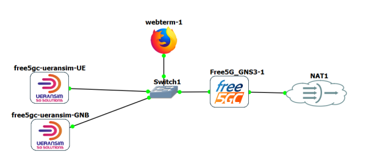
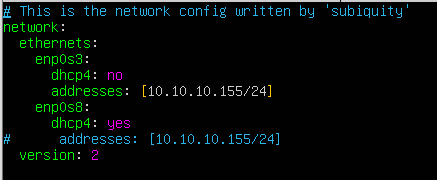
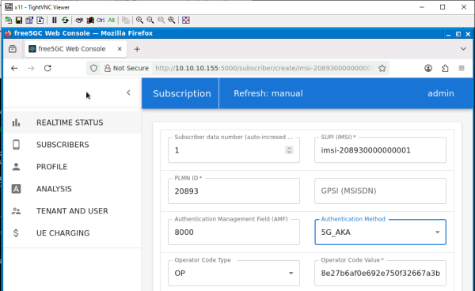
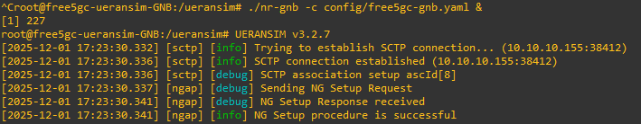
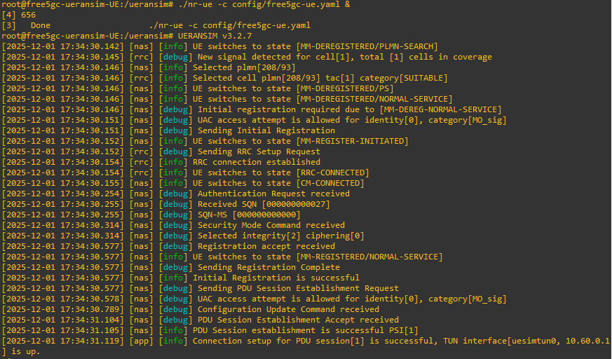
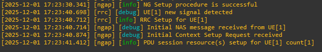
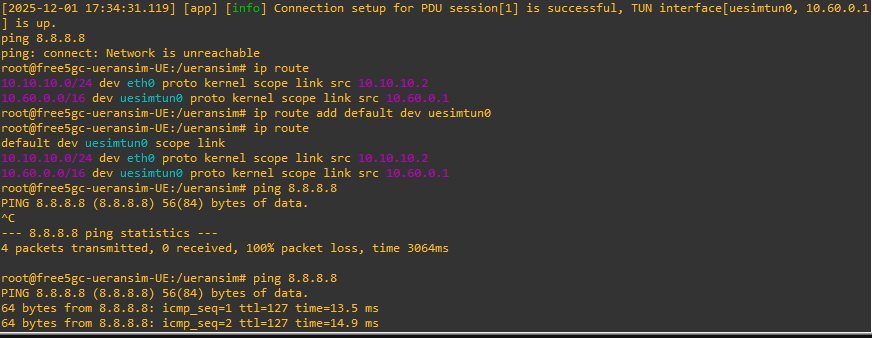

# (Escenario 1) Free5GC (VM) + Ueransim GNB (docker) + Ueransim UE (docker)

\

# Free5GC (VM) + Ueransim GNB (docker) + Ueransim UE (docker)

Esta es la configuración más sencilla posible, en la que CORE y RAN
están en la misma red (10.10.10.0/24). Para ello se interconectan todos
los elementos mediante un simple Switch. El nodo Core es el único que
tiene acceso a Internet.

## Core: FREE5GC

La red CORE está basada en la máquina virtual básica recomendada por
Free5GC (ver [Instalación en Ubuntu
22.04](5GTACTIC--CORE--FREE5GC--Instalación_en_Ubuntu_22.04_30.html))

La VM está creada sobre
[VirtualBox](Aprendiendo_Python--VirtualBox_83.html), y se ha creado un
Template en GNS3 con el nombre Free5GC_GNS3

Incluye dos interfaces de red:

enp0s3 : Conecta la red del operador, y parte de la IP 10.10.10.155/24

enp0s8 : Conecta a Internet, utilizando un nodo NAT

Su configuración aparece en /etc/netplan/00-installer-config.yaml:

La ruta por defecto debe ser siempre por la interfaz enp0s8 (Internet)
que actuará como DNN del Core.

Para lanzar el Core:

1.  Comprobamos que el módulo gtp5g está activo:

    modprobe gtp5g

1.  Activamos el NAT Forwarding para actuar como salida a Internet:

    ./reload_host_config.sh enp0s3

1.  Iniciamos el docker de MONGODB:

    sudo docker run -d --name mongodb -p 27017:27017 mongo:4.2

1.  Lanzamos el core en background:

    sudo ./run.sh &

## Edición de la base de datos de Subscriptores

Si necesitamos editar los parámetros de subscripcción, es necesario
activar la aplicación WebConsole en la VM del Core.

    cd ~/free5gc/webconsole
    ./bin/webconsole

Para acceder a la aplicación se utiliza un docker que incluye un
navegador. El template se genera automáticamente en GNS3 sin más que
seguir: *NewTemplate-\>Install an appliance from GNS3
Server-\>Guests-\>Webterm*.

Una vez añadido el nodo Webterm, configuramos la red simplemente
modificando el contenido del fichero de texto que se encuentra en
*Configure-\>Network(Edit)*:

    #
    # This is a sample network config, please uncomment lines to configure the network
    #

    # Uncomment this line to load custom interface files
    # source /etc/network/interfaces.d/*

    # Static config for eth0
    auto eth0
    iface eth0 inet static
     address 10.10.10.3
     netmask 255.255.255.0
     gateway 10.10.10.1
    # up echo nameserver 192.168.0.1 > /etc/resolv.conf

    # DHCP config for eth0
    #auto eth0
    #iface eth0 inet dhcp
    # hostname webterm-1

Una vez arrancado el nodo, podemos acceder a la consola (abre un VNC),
que directamente nos muestra el navegador. En este caso ponemos la URL
del nodo core: <http://10.10.10.155:5000>, indicando usuario *admin* y
pass *free5gc*. Si no hay ningún subscriber en la base de datos, creamos
uno, dejando todo por defecto, salvo el Operator Code Type que cambiamos
de **OPC** a **OP**:

## UERANSIM (GNB + UE)

Los docker que utilizaremos para el GNB y el UE se obtienen de la
distribución que existe directamente en Free5GC (ver [Instalación en
docker](5GTACTIC--CORE--FREE5GC--Instalación_en_docker_39.html)).

En este caso se han generado imágenes de todos los elementos (las
imágenes base aparecen como free5gc/xx, por ejemplo free5gc/ueransim) ,
pero solo se han construido (make) las del doker del UPF y del docker de
ueransim, que aparecen con los nombres free5gc-compose-upf y
free5gc-compose-ueransim.

La instalación se debe realizar directamente en la máquina GNS3 VM HV,
que deberá tener acceso a Internet (ver [Añadir acceso a Internet a la
GNS3
VM](Virtualización--GNS3--GNS3_con_Hyper-V_VM--Añadir_acceso_a_Internet_a_la_GNS3_VM_158.html))

IMPORTANTE: Es fundamental que las versiones del GNB y UE sean iguales
(no se pueden combinar versiones diferentes)

El template en GNS3 se crea directamente a partir de las imágenes
anteriores, y se le asignan dos interfaces de red, una para conectar a
la red 10.10.10.0/24, y una segunda que nos valdrá por si tenemos que
darle acceso a Internet. La configuración es como sigue:

    # Static config for eth0
    auto eth0
     iface eth0 inet static
     address 10.10.10.2
     netmask 255.255.255.0
     gateway 10.10.10.1

    # DHCP config for eth1
    auto eth1
    iface eth1 inet dhcp

TRUCO: En caso de necesitar instalar cosas, para darle acceso a
Internet, paramos el docker, y conectamos eth1 a una nube NAT.

Actualmente solo hay un template para el GNB y el UE, que se llama
free5gc-ueransim

IMPORTANTE: Los docker llevan lo básico para ejecutar la función. No
tienen editor de texto ni herramientas de red (salvo IP). Incluso no
tiene instalados los ficheros de configuración, por lo que es necesario
crearlos.

TODO.- Hay que mirar si se puede crear el template específico para GNB o
UE añadiendo los comandos de inicio, y añadir los ficheros de
configuración durante la creación del nodo

El fichero de configuración del GNB (free5gc-gnb.yaml) tiene el
siguiente contenido:

    mcc: '208'          # Mobile Country Code value
    mnc: '93'           # Mobile Network Code value (2 or 3 digits)

    nci: '0x000000010'  # NR Cell Identity (36-bit)
    idLength: 32        # NR gNB ID length in bits [22...32]
    tac: 1              # Tracking Area Code

    linkIp: 10.10.10.7 #127.0.0.1   # gNB's local IP address for Radio Link Simulation (Usually same with local IP)
    ngapIp: 10.10.10.7 #127.0.0.1   # gNB's local IP address for N2 Interface (Usually same with local IP)
    gtpIp: 10.10.10.7 #127.0.0.1    # gNB's local IP address for N3 Interface (Usually same with local IP)

    # List of AMF address information
    amfConfigs:
      - address: 10.10.10.155 #127.0.0.1
        port: 38412

    # List of supported S-NSSAIs by this gNB
    slices:
      - sst: 0x1
        sd: 0x010203

    # Indicates whether or not SCTP stream number errors should be ignored.
    ignoreStreamIds: true

Y se pone en marcha con:

    ./nr-gnb -c config/free5gc-gnb.yaml &

Para el caso del UE, el fichero se llama free5gc-ue.yaml:

    # IMSI number of the UE. IMSI = [MCC|MNC|MSISDN] (In total 15 digits)
    supi: 'imsi-208930000000001'
    # Mobile Country Code value of HPLMN
    mcc: '208'
    # Mobile Network Code value of HPLMN (2 or 3 digits)
    mnc: '93'
    # SUCI Protection Scheme : 0 for Null-scheme, 1 for Profile A and 2 for Profile B
    protectionScheme: 0
    # Home Network Public Key for protecting with SUCI Profile A
    homeNetworkPublicKey: '5a8d38864820197c3394b92613b20b91633cbd897119273bf8e4a6f4eec0a650'
    # Home Network Public Key ID for protecting with SUCI Profile A
    homeNetworkPublicKeyId: 1
    # Routing Indicator
    routingIndicator: '0000'

    # Permanent subscription key
    key: '8baf473f2f8fd09487cccbd7097c6862'
    # Operator code (OP or OPC) of the UE
    op: '8e27b6af0e692e750f32667a3b14605d'
    # This value specifies the OP type and it can be either 'OP' or 'OPC'
    opType: 'OP'
    # Authentication Management Field (AMF) value
    amf: '8000'
    # IMEI number of the device. It is used if no SUPI is provided
    imei: '356938035643803'
    # IMEISV number of the device. It is used if no SUPI and IMEI is provided
    imeiSv: '4370816125816151'

    # List of gNB IP addresses for Radio Link Simulation
    gnbSearchList:
      - 10.10.10.7 #127.0.0.1

    # UAC Access Identities Configuration
    uacAic:
      mps: false
      mcs: false

    # UAC Access Control Class
    uacAcc:
      normalClass: 0
      class11: false
      class12: false
      class13: false
      class14: false
      class15: false

    # Initial PDU sessions to be established
    sessions:
      - type: 'IPv4'
        apn: 'internet'
        slice:
          sst: 0x01
          sd: 0x010203

    # Configured NSSAI for this UE by HPLMN
    configured-nssai:
      - sst: 0x01
        sd: 0x010203

    # Default Configured NSSAI for this UE
    default-nssai:
      - sst: 0x01
        sd: 0x010203

    # Supported integrity algorithms by this UE
    integrity:
      IA1: true
      IA2: true
      IA3: true
      
    # Supported encryption algorithms by this UE
    ciphering:
      EA1: true
      EA2: true
      EA3: true

    # Integrity protection maximum data rate for user plane
    integrityMaxRate:
      uplink: 'full'
      downlink: 'full'

Y se pone en marcha con:

     ./nr-ue -c config/free5gc-ue.yaml &

Proceso

Arrancamos el CORE y lanzamos Free5GC

Arrancamos el GNB:

Arrancamos el UE:

En el GNB veremos la asociación:

Una vez establecido el enlace UE-UPF, hay que configurar la ruta de
salida del UE:

