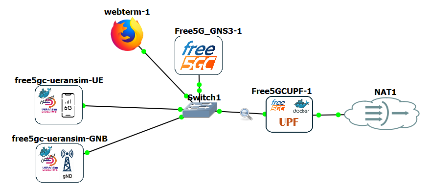
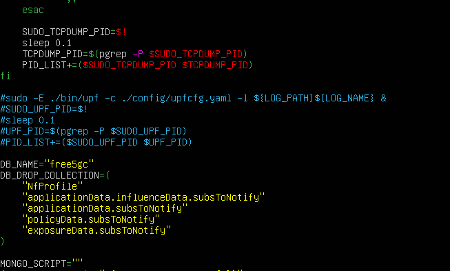
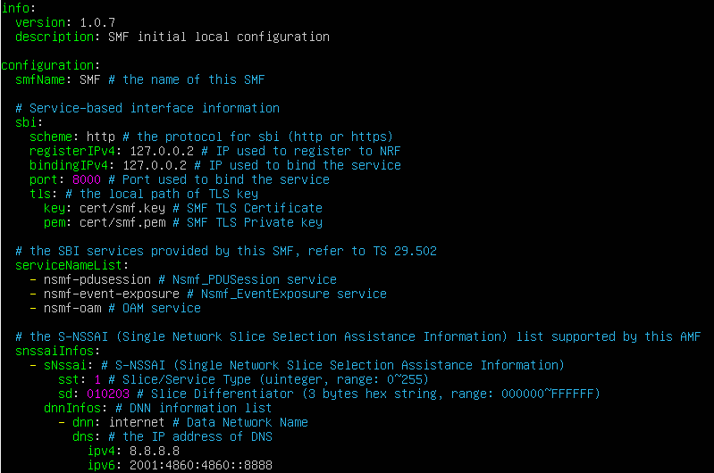
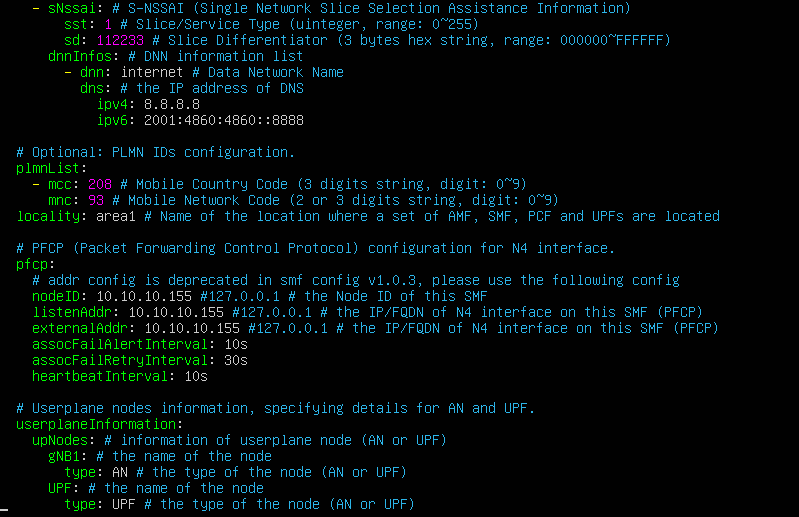
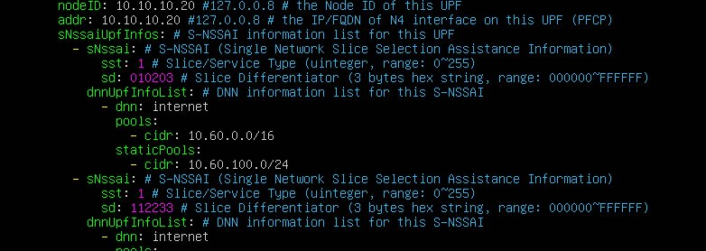
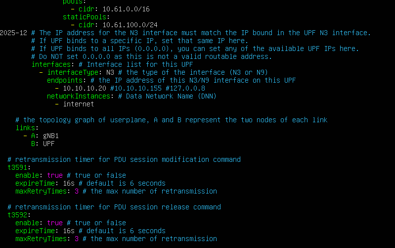
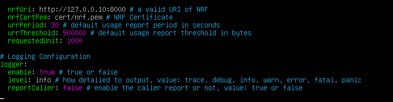
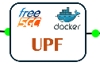
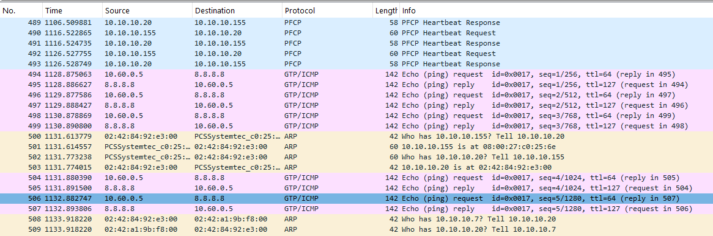

# (Escenario2) Free5GC(VM) + UPF(docker) + UERANSIM GNB(docker)/UE(docker)

\

# Free5GC(VM) + UPF(docker) + UERANSIM GNB(docker)/UE(docker)

Seguimos probando configuraciones sencillas. En este caso vamos a
ejecutar la NF de Free5GC en la VM, pero sin incluir la UPF, que
añadiremos mediante un Docker externo. Todos los elementos siguen en la
miama red (10.10.10.0/24), pero solamente hay salida a Internet pasando
por el UPF (IMPORTANTE: ESTO SIGNIFICA QUE SOLAMENTE TENDRÁ ACCESO A
INTERNET EL UE UNA VEZ SE CONECTE!!!)

Salvo el UPF, el resto de elementos son idénticos a los del escenario 1,
salvo que el NAT se conecta solo al UPF, y que hay que cambiar las
configuraciones de la VM.

## PASO PREVIO: activar GTP5G en GNS3 VM HV

y activar FORWARDING

Debemos asegurarnos que el HOST en donde se lancen los dockers (en este
caso el UPF) tenga incluida la librería GTP5G. En este caso, como los
Dockers se ejecutan en la VM de GNS (GNS3 VM HV), procedemos con su
instalación:

Instalamos el GTP kernel module, que es utilizado por los UPF

    sudo git clone -b v0.9.5 https://github.com/free5gc/gtp5g.git
    cd gtp5g
    sudo make
    sudo make install
    modprobe gtp5g

NOTA.- Si falla, volver a instalar

NOTA.- al hacer el make puede dar un “Skipping BTF generation fo
/home/gns3/gtp5g/gtp5g.ko due to unavailability of vmlinux” (documentado
en [Problemas con MAKE
GTP5G](--Training_-_Configuraciones_GNS3--(Escenario2)_Free5GC(VM)_+_UPF(docker)_+_UERANSIM_GNB(docker)-UE(docker)--Problemas_con_MAKE_GTP5G_166.html))

Antes de salir, debemos asegurarnos que el FORWARDING está habilitado en
la GNS3 VM, para que así los docker creados en ella, hereden esta
propiedad (necesario para el que UPF actúe como pasarela hacia
Internet):

    sudo sysctl -w net.ipv4.ip_forward=1

IMPORTANTE.- Normalmente, además de activar esta variable de entorno, se
configuran las iptables, pero en este caso, basta hacerlo directamente
en el docker (UPF)

## Core: FREE5GC

La red CORE está basada en el Template en con el nombre Free5GC_GNS3

Aunque incluye dos interfaces de red, solamente conectaremos la primera,
al switch, para pertenecer a la red 10.10.10.0/24:

enp0s3 : Conecta la red del operador, y parte de la IP 10.10.10.155/24

enp0s8 : Se deja desconectada (TODO: Igual se puede utilizar esta
interfaz para conectar directamente el Webterm con otro switch, y que
así ese docker no ocupe un IP de la red CORE)

De momento, la ruta por defecto no tienen ningún sentido.

Para lanzar el Core, primero tenemos que preparar una modificación de
SCRIPT run.sh.

Editamos run.sh en donde comentamos las 5 líneas las que se lanza el
UPF:

Gaurdamos y lo llamaremos run2.sh.

Sin embargo, antes de lanzar el Script, debemos configurar el SMF
(config/smfcfg.yaml):

Cambios en:

    linea 52         nodeID: 10.10.10.155 #127.0.0.1 # the Node ID of this SMF
    línea 53      listenAddr: 10.10.10.155 #127.0.0.1 # the IP/FQDN of N4 interface on this SMF (PFCP)
    línea 54       externalAddr: 10.10.10.155 #127.0.0.1 # the IP/FQDN of N4 interface on this SMF (PFCP)

    línea 66       nodeID: 10.10.10.20 #127.0.0.8 # the Node ID of this UPF
    línea 67       addr: 10.10.10.20 #127.0.0.8 # the IP/FQDN of N4 interface on this UPF (PFCP)

    línea 94        - 10.10.10.155 #127.0.0.8

El fichero completo:

IMPORTANTE: Nos aseguramos de cambiar TAMBIEN el fichero amfcfg.yaml tal
como se indica en [(Escenario 1) Free5GC (VM) + Ueransim GNB (docker) +
Ueransim UE
(docker)](5GTACTIC--GNS3--Training_-_Configuraciones_GNS3--(Escenario_1)_Free5GC_(VM)_+_Ueransim_GNB_(docker)_+_Ueransim_UE_(docker)_160.html)

Ahora sí

1.  Comprobamos que el módulo gtp5g está activo:

    modprobe gtp5g

1.  Activamos el NAT Forwarding para actuar como salida a Internet:

    ./reload_host_config.sh enp0s3

1.  Iniciamos el docker de MONGODB:

    sudo docker run -d --name mongodb -p 27017:27017 mongo:4.2

1.  Lanzamos el core en background:

    sudo ./run2.sh &

## Edición de la base de datos de Subscriptores

Puede haber algún problema con la base de datos, que se vacía al
reiniciar la máquina (o el docker de mongodb).

Se puede activar el webconsole y poner el subscriber por defecto
cambiando OPC por OP:

    cd ~/free5gc/webconsole
    go run server.go &

TODO.- Añadir un volumen persistente al docker de MongoDB para que
mantenga el listado de subscriptores

## UPF (docker)

La imagen que hemos montado en le GNS3 VM HV tiene el nombre
gitunican/upf-free5gc:seeder (basada en la imagen
free5gc-compose-free5gc-upf). Hemos creado un Template en GNS3 con el
nombre “gitunican-UPF-free5gc”.

Lo mismo que en el caso de UERANSIM, el template incluye dos interfaces,
la primera para conectar a la CN (con IP 10.10.10.20/24), y la segunda
para conectar a la NAT y simular el DNN

ACTUALIZACIÓN: La imagen creada incluye la copia de los ficheros de
configuración incluidos, así como herramientas como nano, net-tools y
ping. Detalles en [Autoconfigurar el Docker UPF por
Defecto](figuraciones_GNS3--(Escenario2)_Free5GC(VM)_+_UPF(docker)_+_UERANSIM_GNB(docker)-UE(docker)--Autoconfigurar_el_Docker_UPF_por_Defecto_163.html)

Una vez arrancado el Docker, abrimos consola y lanzamos el UPF:

    cd free5gc
    ./upf -c config/upfcfg.yaml &

Una vez lanzado el UPF, es necesario asegurar que la interfaz upfgtp
esté configurada en las IPTABLES:

     iptables -t nat -A POSTROUTING -s 10.60.0.0/16 ! -o upfgtp -j MASQUERADE

Y asegurarnos que la ruta por defecto es a través de la NAT

## UERANSIM (GNB + UE)

Los docker que utilizaremos para el GNB y el UE son los mismos del
[(Escenario 1) Free5GC (VM) + Ueransim GNB (docker) + Ueransim UE
(docker)](5GTACTIC--GNS3--Training_-_Configuraciones_GNS3--(Escenario_1)_Free5GC_(VM)_+_Ueransim_GNB_(docker)_+_Ueransim_UE_(docker)_160.html)

La configuración es idéntica, por lo que solo resta arrancar los Docker
y lanzar el GNB y el UE.

Una vez conectados, hay que recordar que hay que configurar la ruta de
salida en el UE por la interfaz uesimtun0.

NOTA.- En caso de que no funcione el ping 8.8.8.8 desde el UE, comprobar
también la ruta por defecto del UPF, que debe salir por la NAT

