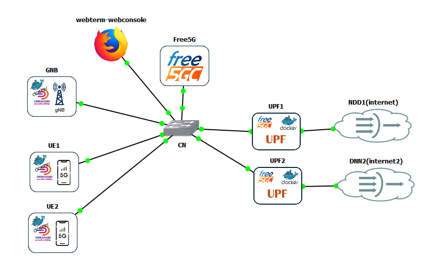
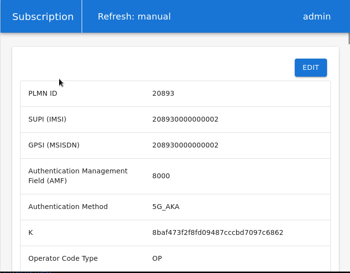
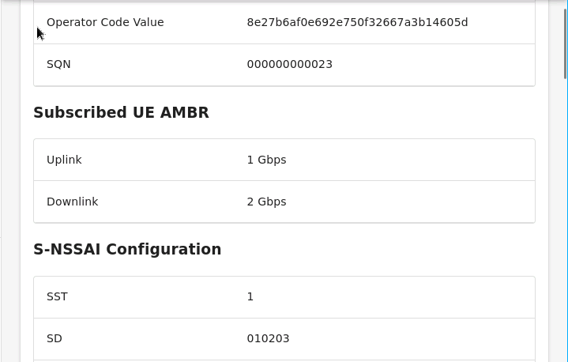
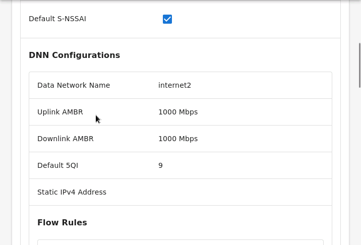
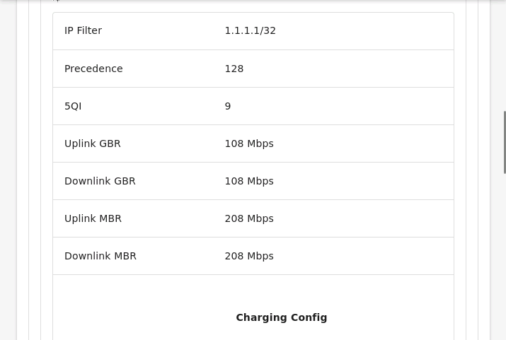
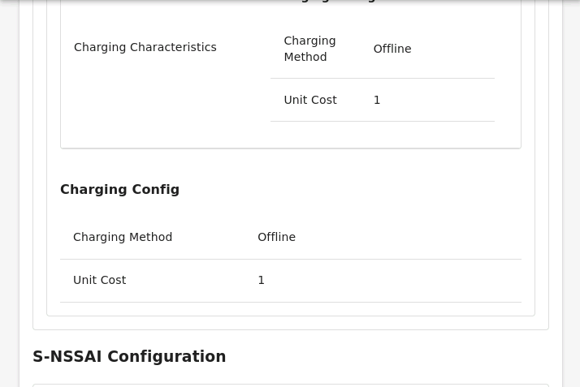
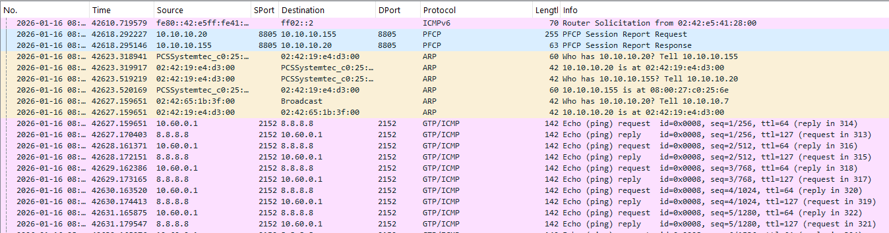
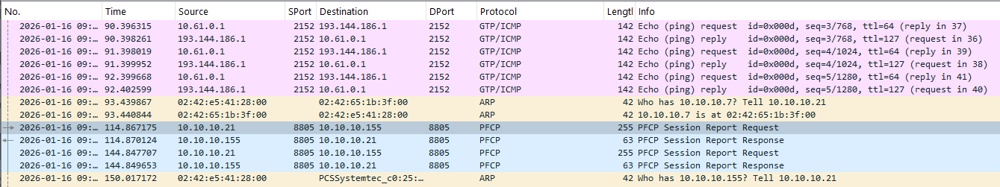

# (Escenario 3) Free5GC(VM)+2UPF(docker)+UERANSIM GNB(docker)/UE(docker)

\

# (Escenario 3) Free5GC(VM)+2UPF(docker)+UERANSIM GNB(docker)/UE(docker)

Continuamos complicando un poco más la configuración de la red. Añadimos
un segundo UPF, y por tanto otro DNN para dar acceso a Internet.

IMPORTANTE: solo hay 1 slice, aunque con dos DNN diferenciados. UE1
utiliza “internet” y UE2 utiliza “internet2”

## PASO PREVIO: activar GTP5G en GNS3 VM HV

y activar FORWARDING

Tenemos que asegurarnos de repetir los pasos indicados en [(Escenario2)
Free5GC(VM) + UPF(docker) + UERANSIM
GNB(docker)/UE(docker)](5GTACTIC--GNS3--Training_-_Configuraciones_GNS3--(Escenario2)_Free5GC(VM)_+_UPF(docker)_+_UERANSIM_GNB(docker)-UE(docker)_161.html)

## Core: FREE5GC

La red CORE está basada en el Template en con el nombre Free5GC_GNS3.

Replicamos todo el proceso inicial indicado en [(Escenario2)
Free5GC(VM) + UPF(docker) + UERANSIM
GNB(docker)/UE(docker)](5GTACTIC--GNS3--Training_-_Configuraciones_GNS3--(Escenario2)_Free5GC(VM)_+_UPF(docker)_+_UERANSIM_GNB(docker)-UE(docker)_161.html),
hasta llegar a los cambios de configuración del SMF.

Nos aseguramos de configurar de forma correcta el UPF1:

Cambios en:

    linea 52      nodeID: 10.10.10.155 #127.0.0.1 # the Node ID of this SMF
    línea 53      listenAddr: 10.10.10.155 #127.0.0.1 # the IP/FQDN of N4 interface on this SMF (PFCP)
    línea 54       externalAddr: 10.10.10.155 #127.0.0.1 # the IP/FQDN of N4 interface on this SMF (PFCP)

    línea 66       nodeID: 10.10.10.20 #127.0.0.8 # the Node ID of this UPF
    línea 67       addr: 10.10.10.20 #127.0.0.8 # the IP/FQDN of N4 interface on this UPF (PFCP)

    línea 94        - 10.10.10.155 #127.0.0.8

Y añadimos el nuevo UPF2, modificando la estructura original del
fichero, en la que hay dos NSSAI en el UPF. En este caso:

1.  duplicamos la estructura completa de UPF
2.  renombramos la primera como UPF1 y la segunda como UPF2
3.  dejamos en primer NSSAI para el UPF1, manteniendo el sd: 010203 y
    dnn: internet (o comentamos el otro NSSAI con id:112233)
4.  dejamos el primer NSSAI para el UPF2, con sd: 010203 pero dnn:
    internet2, que aparece dos veces (Comentamos el otro NSSAI con id:
    112233)

Solo nos falta añadir en los dos UPF, justo después del addr:

    ulcl: false

En **Free5GC**, la opción `ulcl: false` se coloca dentro de la sección
**`userplane_information`** del archivo `smfcfg.yaml`, específicamente
en la definición del nodo UPF. Esto indica si el UPF soporta **ULCL
(Uplink Classifier)**. Si `ulcl` está en `true`, el SMF intentará
configurar reglas ULCL en el UPF, lo que puede fallar si el UPF no
soporta esa función. Para la mayoría de pruebas con UERANSIM y Free5GC,
se deja en `false`.

En general:

- Si **no** vas a usar arquitectura ULCL (split I‑UPF/PSA‑UPF), mantener
  `ulcl: false` evita que el SMF genere reglas de clasificación uplink
  que podrían fallar si el UPF no está preparado para ello.
- Cuando uses un único UPF “todo en uno” (N3↔N6), pon `ulcl: false`.
- Si algún día montas ULCL (varios UPFs con N9 entre ellos), el I‑UPF
  llevaría `ulcl: true` y habría que añadir enlaces N9 en `interfaces` y
  `links` acorde a esa topología.

El fichero resultante sería:

    :
      version: 1.0.7
      description: SMF initial local configuration

    configuration:
      smfName: SMF # the name of this SMF

      # Service-based interface information
      sbi:
        scheme: http # the protocol for sbi (http or https)
        registerIPv4: 127.0.0.2 # IP used to register to NRF
        bindingIPv4: 127.0.0.2 # IP used to bind the service
        port: 8000 # Port used to bind the service
        tls: # the local path of TLS key
          key: cert/smf.key # SMF TLS Certificate
          pem: cert/smf.pem # SMF TLS Private key

      # the SBI services provided by this SMF, refer to TS 29.502
      serviceNameList:
        - nsmf-pdusession # Nsmf_PDUSession service
        - nsmf-event-exposure # Nsmf_EventExposure service
        - nsmf-oam # OAM service

      # the S-NSSAI (Single Network Slice Selection Assistance Information) list supported by this AMF
      snssaiInfos:
        - sNssai: # S-NSSAI (Single Network Slice Selection Assistance Information)
            sst: 1 # Slice/Service Type (uinteger, range: 0~255)
            sd: 010203 # Slice Differentiator (3 bytes hex string, range: 000000~FFFFFF)
          dnnInfos: # DNN information list
            - dnn: internet # Data Network Name
              dns: # the IP address of DNS
                ipv4: 8.8.8.8
                ipv6: 2001:4860:4860::8888
            - dnn: internet2 # Data Network Name
              dns: # the IP address of DNS
                ipv4: 8.8.8.8
                
      # Optional: PLMN IDs configuration.
      plmnList:
        - mcc: 208 # Mobile Country Code (3 digits string, digit: 0~9)
          mnc: 93 # Mobile Network Code (2 or 3 digits string, digit: 0~9)
      locality: area1 # Name of the location where a set of AMF, SMF, PCF and UPFs are located

      # PFCP (Packet Forwarding Control Protocol) configuration for N4 interface.
      pfcp:
        # addr config is deprecated in smf config v1.0.3, please use the following config
        nodeID: 10.10.10.155 #127.0.0.1 # the Node ID of this SMF
        listenAddr: 10.10.10.155 #127.0.0.1 # the IP/FQDN of N4 interface on this SMF (PFCP)
        externalAddr: 10.10.10.155 #127.0.0.1 # the IP/FQDN of N4 interface on this SMF (PFCP)
        assocFailAlertInterval: 10s
        assocFailRetryInterval: 30s
        heartbeatInterval: 10s

      # Userplane nodes information, specifying details for AN and UPF.
      userplaneInformation:
        upNodes: # information of userplane node (AN or UPF)
          gNB1: # the name of the node
            type: AN # the type of the node (AN or UPF)
             an_ip: 10.10.10.7
          UPF1: # the name of the node
            type: UPF # the type of the node (AN or UPF)
            nodeID: 10.10.10.20 #127.0.0.8 # the Node ID of this UPF
            addr: 10.10.10.20 #127.0.0.8 # the IP/FQDN of N4 interface on this UPF (PFCP)
            ulcl: false
            sNssaiUpfInfos: # S-NSSAI information list for this UPF
              - sNssai: # S-NSSAI (Single Network Slice Selection Assistance Information)
                  sst: 1 # Slice/Service Type (uinteger, range: 0~255)
                  sd: 010203 # Slice Differentiator (3 bytes hex string, range: 000000~FFFFFF)
                dnnUpfInfoList: # DNN information list for this S-NSSAI
                  - dnn: internet
                    pools:
                      - cidr: 10.60.0.0/16
                    staticPools:
                      - cidr: 10.60.100.0/24
            # The IP address for the N3 interface must match the IP bound in the UPF N3 interface.
            # If UPF binds to a specific IP, set that same IP here.
            # If UPF binds to all IPs (0.0.0.0), you can set any of the available UPF IPs here.
            # Do NOT set 0.0.0.0 as this is not a valid routable address.
            interfaces: # Interface list for this UPF
              - interfaceType: N3 # the type of the interface (N3 or N9)
                endpoints: # the IP address of this N3/N9 interface on this UPF
                  - 10.10.10.20 #127.0.0.8
                networkInstances: # Data Network Name (DNN)
                  - internet
          UPF2: # the name of the node
            type: UPF # the type of the node (AN or UPF)
            nodeID: 10.10.10.21 #127.0.0.8 # the Node ID of this UPF
            addr: 10.10.10.21 #127.0.0.8 # the IP/FQDN of N4 interface on this UPF (PFCP)
            ulcl: false
            sNssaiUpfInfos: # S-NSSAI information list for this UPF
              - sNssai: # S-NSSAI (Single Network Slice Selection Assistance Information)
                  sst: 1 # Slice/Service Type (uinteger, range: 0~255)
                  sd: 010203 # Slice Differentiator (3 bytes hex string, range: 000000~FFFFFF)
                dnnUpfInfoList: # DNN information list for this S-NSSAI
                  - dnn: internet2
                    pools:
                      - cidr: 10.61.0.0/16
                    staticPools:
                      - cidr: 10.61.100.0/24
            # The IP address for the N3 interface must match the IP bound in the UPF N3 interface.
            # If UPF binds to a specific IP, set that same IP here.
            # If UPF binds to all IPs (0.0.0.0), you can set any of the available UPF IPs here.
            # Do NOT set 0.0.0.0 as this is not a valid routable address.
            interfaces: # Interface list for this UPF
              - interfaceType: N3 # the type of the interface (N3 or N9)
                endpoints: # the IP address of this N3/N9 interface on this UPF
                  - 10.10.10.21 #127.0.0.8
                networkInstances: # Data Network Name (DNN)
                  - internet2
        # the topology graph of userplane, A and B represent the two nodes of each link
        links:
          - A: gNB1
            B: UPF1
          - A: gNB1
            B: UPF2

      # retransmission timer for PDU session modification command
      t3591:
        enable: true # true or false
        expireTime: 16s # default is 6 seconds
        maxRetryTimes: 3 # the max number of retransmission

      # retransmission timer for PDU session release command
      t3592:
        enable: true # true or false
        expireTime: 16s # default is 6 seconds
        maxRetryTimes: 3 # the max number of retransmission

      nrfUri: http://127.0.0.10:8000 # a valid URI of NRF
      nrfCertPem: cert/nrf.pem # NRF Certificate
      urrPeriod: 30 # default usage report period in seconds
      urrThreshold: 500000 # default usage report threshold in bytes
      requestedUnit: 1000

    # Logging Configuration
    logger:
      enable: true # true or false
      level: info # how detailed to output, value: trace, debug, info, warn, error, fatal, panic
      reportCaller: false # enable the caller report or not, value: true or false

Ahora toca modificar el fichero amfcfg.yaml.

Empezamos comprobando que la IP del AMF esté bien puesta:

      amfName: AMF # the name of this AMF
      ngapIpList:  # the IP list of N2 interfaces on this AMF
        - 10.10.10.155 #127.0.0.18

Solo queda otro pequeño cambio en la línea 57, añadiendo internet2:

      supportDnnList:
        - internet
        - internet2  

El fichero queda como:

    info:
      version: 1.0.9
      description: AMF initial local configuration

    configuration:
      amfName: AMF # the name of this AMF
      ngapIpList:  # the IP list of N2 interfaces on this AMF
        - 10.10.10.155 #127.0.0.18
      ngapPort: 38412 # the SCTP port listened by NGAP

      # Service-based Interface (SBI) Configuration
      sbi:
        scheme: http # the protocol for sbi (http or https)
        registerIPv4: 127.0.0.18 # IP used to register to NRF
        bindingIPv4: 127.0.0.18  # IP used to bind the service
        port: 8000 # port used to bind the service
        tls: # the local path of TLS key
          pem: cert/amf.pem # AMF TLS Certificate
          key: cert/amf.key # AMF TLS Private key

      # SBI Services offered by this AMF, as per TS 29.518
      serviceNameList:
        - namf-comm # Namf_Communication service
        - namf-evts # Namf_EventExposure service
        - namf-mt   # Namf_MT service
        - namf-loc  # Namf_Location service
        - namf-oam  # OAM service

      # Guami (Globally Unique AMF ID) list supported by this AMF
      servedGuamiList:
        # <GUAMI> = <MCC><MNC><AMF ID>
        - plmnId: # Public Land Mobile Network ID, <PLMN ID> = <MCC><MNC>
            mcc: 208 # Mobile Country Code (3 digits string, digit: 0~9)
            mnc: 93 # Mobile Network Code (2 or 3 digits string, digit: 0~9)
          amfId: cafe00 # AMF identifier (3 bytes hex string, range: 000000~FFFFFF)

      # the TAI (Tracking Area Identifier) list supported by this AMF
      supportTaiList:
        - plmnId: # Public Land Mobile Network ID, <PLMN ID> = <MCC><MNC>
            mcc: 208 # Mobile Country Code (3 digits string, digit: 0~9)
            mnc: 93 # Mobile Network Code (2 or 3 digits string, digit: 0~9)
          tac: 000001 # Tracking Area Code (3 bytes hex string, range: 000000~FFFFFF)

      # the PLMNs (Public land mobile network) list supported by this AMF
      plmnSupportList:
        - plmnId: # Public Land Mobile Network ID, <PLMN ID> = <MCC><MNC>
            mcc: 208 # Mobile Country Code (3 digits string, digit: 0~9)
            mnc: 93 # Mobile Network Code (2 or 3 digits string, digit: 0~9)
          snssaiList: # the S-NSSAI (Single Network Slice Selection Assistance Information) list supported by this AMF
            - sst: 1 # Slice/Service Type (uinteger, range: 0~255)
              sd: "010203" # Slice Differentiator (3 bytes hex string, range: 000000~FFFFFF)
            - sst: 1 # Slice/Service Type (uinteger, range: 0~255)
              sd: "112233" # Slice Differentiator (3 bytes hex string, range: 000000~FFFFFF)

      # the DNN (Data Network Name) list supported by this AMF
      supportDnnList:
        - internet
        - internet2
      nrfUri: http://127.0.0.10:8000 # a valid URI of NRF
      nrfCertPem: cert/nrf.pem # NRF Certificate

      # NAS Security Configuration
      # the priority of integrity algorithms
      # the priority of ciphering algorithms
      security:
        integrityOrder:
          - NIA2
          # - NIA0
        cipheringOrder:
          - NEA0
          - NEA2

      # Network Name Information
      networkName:
        full: free5GC
        short: free

      # Optional NGAP Information Elements (IE)
      ngapIE:
        mobilityRestrictionList: # Mobility Restriction List IE, refer to TS 38.413
          enable: true # append this IE in related message or not
        maskedIMEISV: # Masked IMEISV IE, refer to TS 38.413
          enable: true # append this IE in related message or not
        redirectionVoiceFallback: # Redirection Voice Fallback IE, refer to TS 38.413
          enable: false # append this IE in related message or not

      # Optional NAS Information Elements (IE)
      nasIE:
        networkFeatureSupport5GS: # 5gs Network Feature Support IE, refer to TS 24.501
          enable: true # append this IE in Registration accept or not
          length: 1 # IE content length (uinteger, range: 1~3)
          imsVoPS: 0 # IMS voice over PS session indicator (uinteger, range: 0~1)
          emc: 0 # Emergency service support indicator for 3GPP access (uinteger, range: 0~3)
          emf: 0 # Emergency service fallback indicator for 3GPP access (uinteger, range: 0~3)
          iwkN26: 0 # Interworking without N26 interface indicator (uinteger, range: 0~1)
          mpsi: 0 # MPS indicator (uinteger, range: 0~1)
          emcN3: 0 # Emergency service support indicator for Non-3GPP access (uinteger, range: 0~1)
          mcsi: 0 # MCS indicator (uinteger, range: 0~1)
      t3502Value: 720  # timer value (seconds) at UE side
      t3512Value: 3600 # timer value (seconds) at UE side
      non3gppDeregTimerValue: 3240 # timer value (seconds) at UE side
      # retransmission timer for paging message
      t3513:
        enable: true     # true or false
        expireTime: 6s   # default is 6 seconds
        maxRetryTimes: 4 # the max number of retransmission
      # retransmission timer for NAS Deregistration Request message
      t3522:
        enable: true     # true or false
        expireTime: 6s   # default is 6 seconds
        maxRetryTimes: 4 # the max number of retransmission
      # retransmission timer for NAS Registration Accept message
      t3550:
        enable: true     # true or false
        expireTime: 6s   # default is 6 seconds
        maxRetryTimes: 4 # the max number of retransmission
      # retransmission timer for NAS Configuration Update Command message
      t3555:
        enable: true     # true or false
        expireTime: 6s   # default is 6 seconds
        maxRetryTimes: 4 # the max number of retransmission
      # retransmission timer for NAS Authentication Request/Security Mode Command message
      t3560:
        enable: true     # true or false
        expireTime: 6s   # default is 6 seconds
        maxRetryTimes: 4 # the max number of retransmission
      # retransmission timer for NAS Notification message
      t3565:
        enable: true     # true or false
        expireTime: 6s   # default is 6 seconds
        maxRetryTimes: 4 # the max number of retransmission
      # retransmission timer for NAS Identity Request message
      t3570:
        enable: true     # true or false
        expireTime: 6s   # default is 6 seconds
        maxRetryTimes: 4 # the max number of retransmission
      locality: area1 # Name of the location where a set of AMF, SMF, PCF and UPFs are located

      # set the sctp server setting <optinal>, once this field is set, please also add maxInputStream, maxOsStream, maxAttempts, maxInitTimeOut
      sctp:
        numOstreams: 3 # the maximum out streams of each sctp connection
        maxInstreams: 5 # the maximum in streams of each sctp connection
        maxAttempts: 2 # the maximum attempts of each sctp connection
        maxInitTimeout: 2 # the maximum init timeout of each sctp connection
      defaultUECtxReq: false # the default value of UE Context Request to decide when triggering Initial Context Setup procedure

    logger: # log output setting
      enable: true # true or false
      level: info # how detailed to output, value: trace, debug, info, warn, error, fatal, panic
      reportCaller: false # enable the caller report or not, value: true or false

## UPF1 y UPF2 (docker)

Utilizamos un Template en GNS3 con el nombre “gitunican-UPF-free5gc”.

El template incluye dos interfaces, la primera para conectar a la CN
(con IP 10.10.10.20/24 para UPF1 y 10.10.10.21/24 para UPF2), y la
segunda para conectar a las NAT1 y NAT2, simulando dos DNN.

El fichero **upfcfg.yaml** de UPF2 es idéntico que el de
UPF1(10.10.10.20), pero con la IP de UPF2 (10.10.10.21):

    version: 1.0.3
    description: UPF1 initial local configuration

    # The listen IP and nodeID of the N4 interface on this UPF (Can't set to 0.0.0.0)
    pfcp:
      addr: 10.10.10.20
    #0.0.0.0 # IP addr for listening
      nodeID: 10.10.10.20 # External IP or FQDN can be reached
      retransTimeout: 1s # retransmission timeout
      maxRetrans: 3 # the max number of retransmission

    gtpu:
      forwarder: gtp5g
      # The IP list of the N3/N9 interfaces on this UPF
      # If there are multiple connection, set addr to 0.0.0.0 or list all the addresses
      ifList:
        - addr: 10.10.10.20
    #10.10.10.155
          type: N3
          # name: upf.5gc.nctu.me
          # ifname: gtpif
          # mtu: 1400

    # The DNN list supported by UPF
    dnnList:
      - dnn: internet # Data Network Name
        cidr: 10.60.0.0/16 # Classless Inter-Domain Routing for assigned IPv4 pool of UE
        # natifname: eth0

    logger: # log output setting
      enable: true # true or false
      level: info # how detailed to output, value: trace, debug, info, warn, error, fatal, panic
      reportCaller: false # enable the caller report or not, value: true or false

Para poder enrutar a internet o internet2, hacmeos uso de “uerouting”,
para lo cual hay que configurar el fichero uerouting.yaml, con el
siguiente contenido:

    info:
      version: 1.0.7
      description: UE Routing Configuration

    ueRoutingInfo:
      UE1:
        members:
          - imsi-208930000000001
        topology:
          - A: gNB1
            B: UPF1
        specificPath:
          - dest: 10.60.0.0/16
            path: [UPF1]
      UE2:
        members:
          - imsi-208930000000002
        topology:
          - A: gNB1
            B: UPF2
        specificPath:
          - dest: 10.61.0.0/16
            path: [UPF2]

## UERANSIM (GNB + UE1 + UE2)

Los docker que utilizaremos para el GNB y el UE son los que copian los
ficheros de configuración, es decir los de [Autoconfigurar Docker
UERANSIM](ning_-_Configuraciones_GNS3--(Escenario2)_Free5GC(VM)_+_UPF(docker)_+_UERANSIM_GNB(docker)-UE(docker)--Autoconfigurar_Docker_UERANSIM_164.html)

La configuración es idéntica, por lo que solo resta arrancar los Docker
y lanzar el GNB y el UE.

El fichero del UE2 queda:

    # IMSI number of the UE. IMSI = [MCC|MNC|MSISDN] (In total 15 digits)
    supi: 'imsi-208930000000002'
    # Mobile Country Code value of HPLMN
    mcc: '208'
    # Mobile Network Code value of HPLMN (2 or 3 digits)
    mnc: '93'
    # SUCI Protection Scheme : 0 for Null-scheme, 1 for Profile A and 2 for Profile B
    protectionScheme: 0
    # Home Network Public Key for protecting with SUCI Profile A
    homeNetworkPublicKey: '5a8d38864820197c3394b92613b20b91633cbd897119273bf8e4a6f4eec0a650'
    # Home Network Public Key ID for protecting with SUCI Profile A
    homeNetworkPublicKeyId: 1
    # Routing Indicator
    routingIndicator: '0000'

    # Permanent subscription key
    key: '8baf473f2f8fd09487cccbd7097c6862'
    # Operator code (OP or OPC) of the UE
    op: '8e27b6af0e692e750f32667a3b14605d'
    # This value specifies the OP type and it can be either 'OP' or 'OPC'
    opType: 'OP'
    # Authentication Management Field (AMF) value
    amf: '8000'
    # IMEI number of the device. It is used if no SUPI is provided
    imei: '356938035643804'
    # IMEISV number of the device. It is used if no SUPI and IMEI is provided
    imeiSv: '4370816125816152'

    # List of gNB IP addresses for Radio Link Simulation
    gnbSearchList:
      - 10.10.10.7 #127.0.0.1

    # UAC Access Identities Configuration
    uacAic:
      mps: false
      mcs: false

    # UAC Access Control Class
    uacAcc:
      normalClass: 0
      class11: false
      class12: false
      class13: false
      class14: false
      class15: false

    # Initial PDU sessions to be established
    sessions:
      - type: 'IPv4'
        apn: 'internet2'
        slice:
          sst: 0x01
          sd: 0x010203

    # Configured NSSAI for this UE by HPLMN
    configured-nssai:
      - sst: 0x01
        sd: 0x010203

    # Default Configured NSSAI for this UE
    default-nssai:
      - sst: 0x01
        sd: 0x010203

    # Supported integrity algorithms by this UE
    integrity:
      IA1: true
      IA2: true
      IA3: true

    # Supported encryption algorithms by this UE
    ciphering:
      EA1: true
      EA2: true
      EA3: true

    # Integrity protection maximum data rate for user plane
    integrityMaxRate:
      uplink: 'full'
      downlink: 'full'

ATENCIÓN: En el caso del fichero de configuración de UE2 hay que
asegurarse que tiene como DNN a internet2

Hay que registrar al segundo usuario, por lo que en el Webconsole
creamos un perfil con la siguiente configuración (hay que cambiar el
primer nssaid a "internet2")

Una vez conectados, hay que recordar que hay que configurar la ruta de
salida en cada UE por la interfaz uesimtun0.

NOTA.- En caso de que no funcione el ping 8.8.8.8 desde el UE, comprobar
también la ruta por defecto del UPF, que debe salir por la NAT... probar
a hacer PING a otra IP, por si acaso!!!

Capturamos en la interfaz 10.10.10.20 de UPF1 y hacemos ping a 8.8.8.8
desde UE1:

Capturamos en la interfaz 10.10.10.21 de UPF2 y hacemos ping a
193.144.186.1 desde UE2:

Para copiar los ficheros desde los dockers, al utilizar volúmenes, es
necesario comprobar primero cuál es el volumne en el que está
trabajando:

docker inspect \<id\> \| grep -A4 Mounts

En el caso de los UPF, el volumen está en la ruta /gns3volumes, y ahí se
encuentran montados los directorios free5gc/config. Así que para extraer
el fichero de configuración del UPF2 sería algo así como:

docker cp \<id_UPF2_container\>:/gns3volume/free5gc/config/upfcfg_2.yaml

Si no tienes SSH pero tienes conectividad IP:

- En la VM:

cd /ruta/del/archivo

python3 -m http.server 8080

- En el host:

curl http://IP_VM:8080/archivo.ext -o archivo.ext

Para compartir carpeta con la VM:

- Ve a **Carpetas compartidas** → **Añadir nueva carpeta**.
- Elige:• **Ruta de la carpeta**: la carpeta del host que quieres
  compartir.
- **Nombre de la carpeta**: será el identificador dentro de la VM.
- Marca **Automontar** y **Hacer permanente** (opcional).

\*\*\*\* NO PROBADO

Para instalar la VBoxguestadditions:

udo apt update

sudo apt install build-essential dkms linux-headers-\$(uname -r)

Insrertar el CD de VBoxAdd y ejecutar a instalación:

sudo sh /media/\$USER/VBox_GAs\_\*/VBoxLinuxAdditions.run

\*\*\*\*\*\*

En la VM de free5GC parece que funciona sin instalar.

Crea un punto de montaje en la VM

sudo mkdir -p /mnt/compartida

Usa el tipo de sistema `vboxsf`:

sudo mount -t vboxsf compartida /mnt/compartida

Donde:

- `compartida` = nombre definido en VirtualBox.
- `/mnt/compartida` = punto de montaje en la VM.

Accede a la carpeta

cd /mnt/compartida

ls

### (Opcional) Montaje permanente

Edita `/etc/fstab` y añade:

compartida /mnt/compartida vboxsf defaults 0 0

PROBLEMAS CON FORMATO DOS / CR / LF / LR

Al compartir ficheros de sistemas windows a Linux hay siempre
incompatibilidades respecto d elos caracteres CR/LF, por lo que es
necesario convertir los ficheros DOS a formato Linux.

◇ Para u**n solo archivo con** **`sed`** **(sin instalar nada)**:

sed -i 's/\r\$//' /mnt/compartida/archivo.txt

Para una carpeta, en este caso la carpeta compartida, optamos por un
script:

## 🧰 Script: c

## rlf-fix-robusto.sh

Este es un **script Bash** que recorre una carpeta (por defecto, tu
carpeta compartida montada) y convierte todos los ficheros de texto de
**CRLF → LF**.

- Solo procesa **archivos de texto** (evita binarios).
- Tiene modo **dry-run** para ver qué convertiría sin tocar nada.

\#!/usr/bin/env bash

set -euo pipefail

DRY_RUN=false

TARGET_DIR="\${1:-}"

if \[\[ "\${2:-}" == "--dry-run" \]\]; then DRY_RUN=true; fi

if \[\[ -z "\$TARGET_DIR" \|\| ! -d "\$TARGET_DIR" \]\]; then

echo "Uso: \$0 /ruta/a/carpeta \[--dry-run\]" \>&2

exit 1

fi

echo "Escaneando: \$TARGET_DIR"

find "\$TARGET_DIR" -type f -print0 \\

\| while IFS= read -r -d '' f; do

\# ¿Parece texto y contiene '\r'?

if LC_ALL=C grep -Iq . "\$f" && LC_ALL=C grep -q \$'\r' "\$f"; then

if \$DRY_RUN; then

echo "\[DRY-RUN\] Convertiría: \$f"

continue

fi

tmp_meta="\$(mktemp)"

tmp_conv="\$(mktemp)"

touch -r "\$f" "\$tmp_meta"

tr -d '\r' \< "\$f" \> "\$tmp_conv"

cat "\$tmp_conv" \> "\$f"

touch -r "\$tmp_meta" "\$f"

rm -f "\$tmp_meta" "\$tmp_conv"

echo "Convertido: \$f"

fi

done

echo "Hecho."

\`\`

## 🚀 Cómo usarlo

1\. **Guarda el script** en tu VM, por ejemplo: nano crlf-fix-robusto.sh
(Pega el contenido y guarda)

2\. **Hazlo ejecutable**: chmod +x crlf-fix-robusto.sh

3\. **Ejecuta en tu carpeta compartida**: ./crlf-fix-robusto.sh
/mnt/compartida

Sustituye `/mnt/compartida` por tu ruta real si usas otra.

4\. **Primero en modo simulación (recomendado)**: ./crlf-fix-robusto.sh
/mnt/compartida --dry-run

## ✅ Alternativas rápidas

◇ **Convertir todos los .txt de un directorio (no recursivo)** con
`dos2unix`:

sudo apt install -y dos2unix

dos2unix /mnt/compartida/\*.txt

## 🧩 Consejos útiles

◇ Si ves **“Permission denied”** en la carpeta compartida:\\ Añade tu
usuario al grupo `vboxsf` y cierra sesión: sudo usermod -aG vboxsf
\$USER

◇ Si algunos archivos vienen de **Git en Windows**, también puedes
configurar Git para normalizar finales de línea: git config --global
core.autocrlf input

