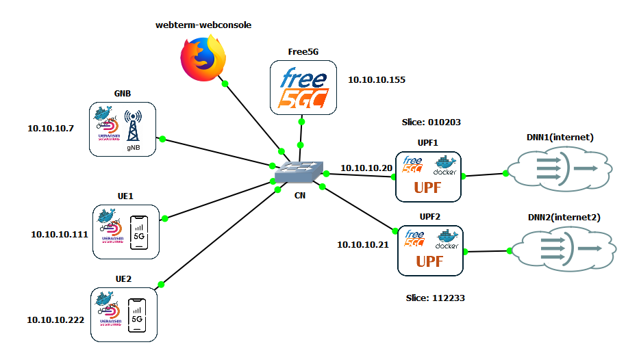
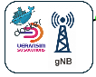
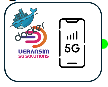

# (Scenario 4) 2 Slice - Free5GC(VM)+2UPF(docker)+UERANSIM GNB(docker)/UE(docker)

The topology is the same as in scenario 3, with only one difference: 2 different slices, one for each
UPF. In UPF1 we will use 010203, which provides access to “internet”, and UPF2 uses
112233, which provides access to “internet2”.

The modifications are minimal.

## PREVIOUS STEP: To activate GTP5G into GNS3_VM

and configure FORWARDING

We must ensure to repeat the steps indicated in [(Scenario 3)
Free5GC(VM)+2UPF(docker)+UERANSIM
GNB(docker)/UE(docker)](../Scenario 3/Scenario_3.md)

## Core: FREE5GC

The CORE network is based on the template named Free5GC_GNS3.

We replicate the initial process described in [(Scenario2)
Free5GC(VM) + UPF(docker) + UERANSIM
GNB(docker)/UE(docker)](./Scenario 2/Scenario_2.md),
until reaching the SMF configuration changes.

We can start del smfcfg.yaml del Scenario 3, editing concrete parts of
UPF2:

- We add the new sNssai: **-**
  sNssai**:**

            sst: 1
            sd: 112233
          dnnInfos:
            - dnn: internet
              dns:
                ipv4: 8.8.8.8
            - dnn: internet2
              dns:
                ipv4: 8.8.8.8

- We modify UPF2 so that it only serves to the new slice:

          UPF2:
            type: UPF
            nodeID: 10.10.10.21
            addr: 10.10.10.21
            sNssaiUpfInfos:
              - sNssai:
                  sst: 1
                  sd: 112233
                dnnUpfInfoList:
                  - dnn: internet2
                    pools:
                      - cidr: 10.61.0.0/16
                    staticPools: []
            interfaces:
              - interfaceType: N3
                endpoints:
                  - 10.10.10.21
                networkInstances:
                  - internet2

Full **smcfg.yaml** file follows:

    info:
      version: 1.0.7
      description: SMFConfigurationScenario3

    configuration:
      smfName: SMF

      sbi:
        scheme: http
        registerIPv4: 127.0.0.2
        bindingIPv4: 127.0.0.2
        port: 8000
        tls:
          key: cert/smf.key
          pem: cert/smf.pem

      serviceNameList:
        - nsmf-pdusession
        - nsmf-event-exposure
        - nsmf-oam

      snssaiInfos:
        - sNssai:
            sst: 1
            sd: 010203
          dnnInfos:
            - dnn: internet
              dns:
                ipv4: 8.8.8.8
            - dnn: internet2
              dns:
                ipv4: 8.8.8.8
        - sNssai:
            sst: 1
            sd: 112233
          dnnInfos:
            - dnn: internet
              dns:
                ipv4: 8.8.8.8
            - dnn: internet2
              dns:
                ipv4: 8.8.8.8

      plmnList:
        - mcc: 208
          mnc: 93

      locality: area1

      pfcp:
        nodeID: 10.10.10.155
        listenAddr: 10.10.10.155
        externalAddr: 10.10.10.155

      userplaneInformation:
        upNodes:
          gNB1:
            type: AN
            an_ip: 10.10.10.7

          UPF1:
            type: UPF
            nodeID: 10.10.10.20
            addr: 10.10.10.20
            sNssaiUpfInfos:
              - sNssai:
                  sst: 1
                  sd: 010203
                dnnUpfInfoList:
                  - dnn: internet
                    pools:
                      - cidr: 10.60.0.0/16
                    staticPools: []
            interfaces:
              - interfaceType: N3
                endpoints:
                  - 10.10.10.20
                networkInstances:
                  - internet

          UPF2:
            type: UPF
            nodeID: 10.10.10.21
            addr: 10.10.10.21
            sNssaiUpfInfos:
              - sNssai:
                  sst: 1
                  sd: 112233
                dnnUpfInfoList:
                  - dnn: internet2
                    pools:
                      - cidr: 10.61.0.0/16
                    staticPools: []
            interfaces:
              - interfaceType: N3
                endpoints:
                  - 10.10.10.21
                networkInstances:
                  - internet2

        links:
          - A: gNB1
            B: UPF1
          - A: gNB1
            B: UPF2

    #  ueRoutingFile: ./config/uerouting.yaml
    #  urrPeriod: 10
    #  urrThreshold: 1000000
    #  requestedUnit: 1000000
      ulcl: false

      t3591:
        enable: true
        expireTime: 16s
        maxRetryTimes: 3

      t3592:
        enable: true
        expireTime: 16s
        maxRetryTimes: 3

      nrfUri: http://127.0.0.10:8000
      nrfCertPem: cert/nrf.pem
      urrPeriod: 30
      urrThreshold: 500000
      requestedUnit: 1000

    logger:
      enable: true
      level: info
      reportCaller: false

## UERANSIM (GNB + UE1 + UE2)

The docker containers that we will use for GNB and UE are the same that complete all the configuration files, that is [Autoconfigurar Docker
UERANSIM](ning_-_Configuraciones_GNS3--(Scenario2)_Free5GC(VM)_+_UPF(docker)_+_UERANSIM_GNB(docker)-UE(docker)--Autoconfigurar_Docker_UERANSIM_164.html)

The configuration is identical, so the only remaining step is to start eacn Docker container
and run GNB / UE1.

For UE2 we must modify config file 
to use a new user into the slice 112233.

Using the same file of UE2 from Scenario 3, we only need to modify each
slice:

    # Initial PDU sessions to be established
    sessions:
      - type: 'IPv4'
        apn: 'internet2'
        slice:
          sst: 0x01
          sd: 0x112233

    # Configured NSSAI for this UE by HPLMN
    configured-nssai:
      - sst: 0x01
        sd: 0x112233

    # Default Configured NSSAI for this UE
    default-nssai:
      - sst: 0x01
        sd: 0x112233

Start UE2 with this new file "free5gc-UE3.yaml.

You'd need to register a third user, using Webconsole 
to create a new profile

assigning a new IMEI, and we modify S-NSSAI to use
slice SD 112233 and DNN "internet2"

