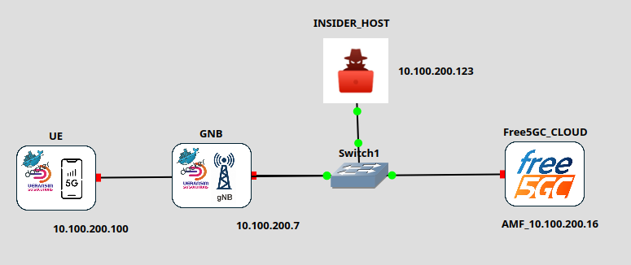

# (Scenario 6) Free5GC + UERANSIM (Docker) + HOST (Insider)

In this case, we are going to use a completely different configuration of Free5GC, this time based on a Docker deployment. The layout is simple because the main interest is being able to interact with the different elements of the 5G network. We start with a gNB and UE identical to previous scenarios, running on the GNS3-VM, the Free5GC deployment over Docker running on the HOST, and we connect the HOST to the scenario to use it as an attacking machine.



Although we could use a specialized VM or Docker container, such as Kali Linux, or build a custom VM/Docker containing all the necessary tools, in many cases our host already includes everything required. Therefore, it can be beneficial to use them directly without duplicating functionalities.

## The HOST as just another device in GNS3

To integrate our HOST machine into GNS3 scenarios, it is necessary to use a virtual interface linked to a GNS3 Cloud node.

### ✅ ✅ Objective

Use your **real Ubuntu machine as the attacking host** inside GNS3, without an extra VM:

```
[Ubuntu host (VS Code / tools)]
            │
      (virtual interface / tap / bridge)
            │
         [Cloud]
            │
      GNS3 Network

```

### 🔧 OPTION 1: Virtual Interface + Cloud

### 🔹 1. Create a virtual interface in Ubuntu

You can do this using `ip`:

```
sudo ip link add gns3-host type dummy
sudo ip addr add 128.100.100.100/24 dev gns3-host
sudo ip link set gns3-host up

```

👉 This creates a "dummy NIC" exclusively for GNS3.

### 🔹 2. Add Cloud in GNS3

1. Add a **Cloud** node.
2. In configuration → select: `gns3-host`
3. Connect it to your switch/router.

### 🔹 3. Configure network in GNS3

Example:

`Ubuntu host: 128.100.100.100`

`COREGW: 128.100.100.1`

### 🔹 4. Routing (if necessary)

If your traffic passes through routers:

```bash
sudo ip route add 128.100.100.0/24 dev gns3-host

```

*(or the specific gateway if applicable)*

### ✅ OPTION 2 (Highly powerful and RECOMMENDED): TAP + Bridge

If you want something more realistic (pro lab level):

### 🔹 Create TAP

```
sudo ip tuntap add dev tap0 mode tap
sudo ip addr add 128.100.100.100/24 dev tap0
sudo ip link set tap0 up

```

Then:

* Cloud → select `tap0`

👉 Advantage:

* Allows more "real" traffic (Ethernet level).
* Useful for advanced attacks (ARP, sniffing).

### ⚡ OPTION 3 (If using GNS3 VM, THE MOST DIRECT AND SIMPLE): Bridge with virtual network

If the GNS3 VM runs on VirtualBox / VMware:

* Connect host ↔ VM using a host-only network.
* Then Cloud uses that interface.

*(You likely have this partially set up if you use GNS3 and the GNS3-VM, but it forces the use of the Host-only network addressing, which is not always desirable).*

### ✅ VERIFICATION

Before continuing with your scenario, perform some connectivity checks, both from the Host and from one of the nodes within the network.

### 🚀 REAL USE WITH VISUAL STUDIO / TOOLS

Now you can directly use the tools on the Host machine:

### 🔹 C / C++

* Raw sockets
* Custom attacks

### 🔹 Python

```bash
pip install scapy

```

### 🔹 Scapy Example:

```python
from scapy.all import *

pkt = IP(dst="128.100.100.1")/ICMP()
send(pkt)

```

### 🔹 .NET / VS Code

You can perform:

* TCP scanners
* Fuzzing
* Exploit simulation
* Controlled malicious traffic generation

### ⚠️ IMPORTANT CONSIDERATIONS

## 🔸 Firewall (iptables / ufw)

Disable or adjust it:

```
sudo ufw disable

```

or allow specific traffic.

## 🔸 Reverse Path Filtering (Crucial)

Linux might block traffic:

```
sudo sysctl -w net.ipv4.conf.all.rp_filter=0

```

## 🔸 Permissions on TAP interfaces

If you use `tap`:

```
sudo chmod 666 /dev/net/tun

```

# FREE5GC in DOCKER Format

Source: [free5gc-compose/README.md at master · free5gc/free5gc-compose · GitHub](https://github.com/free5gc/free5gc-compose/blob/master/README.md)

As an alternative to using Free5GC as a full virtual machine, we have the option to deploy the Free5GC CORE using Docker containers (there are more advanced versions that include orchestration via Kubernetes). The advantage of using this solution is that we can access each of the NFs included in the CORE simply by identifying the corresponding container. Additionally, we can use specialized tools for container management, such as EdgeShark, which is included in this distribution.

## Installing Free5GC Images

> **IMPORTANT:** The distribution for this lab **ALREADY INCLUDES** a pre-installation of the CORE images located on the HOST (Ubuntu), so it is not necessary to complete this building process.

To build the docker images from local sources:

```
# Clone the project
git clone [https://github.com/free5gc/free5gc-compose.git](https://github.com/free5gc/free5gc-compose.git)
cd free5gc-compose

# clone free5gc sources
cd base
git clone --recursive -j"$(nproc)" [https://github.com/free5gc/free5gc.git](https://github.com/free5gc/free5gc.git)
cd ..

# Build the images
make all
docker compose -f docker-compose-build.yaml build

# Alternatively you can build specific NF image e.g.:
make amf
docker compose -f docker-compose-build.yaml build free5gc-amf

```

### Note:

During the creation process, some images might appear in a "dangling" state. It is recommended to remove these images from time to time to free up disk space:

```
docker rmi $(docker images -f "dangling=true" -q)

```

Alternatively, you can use `docker image prune`.

*Note: "Dangling" images are those that do not have a repository name or tag assigned and are not used by any active container.*

# Running Free5GC

We can launch it directly either from local images or from Docker Hub:

```
# use local images
docker compose -f docker-compose-build.yaml up
# use images from docker hub
docker compose up # add -d to run in background mode

```

To avoid leaving lingering containers, it is good practice to destroy them after finishing your tests:

```
# Remove established containers (local images)
docker compose -f docker-compose-build.yaml rm
# Remove established containers (remote images)
docker compose rm

```

# Configuring the User Database

This version of Free5GC utilizes the WebUI interface.

!images/47-5.png

# Using External gNB and UE

The docker distribution includes versions of both the gNB and the UE from UERANSIM, which are integrated into the Free5GC CORE network.

However, it is recommended to use the versions deployed in the previous scenarios for better control over the ACCESS and CORE parts.

Always keep in mind that the CORE network is in the IP range `10.100.200.0/24` (with the AMF IP being `.16`).

> **IMPORTANT:** The default configurations of the UERANSIM dockers present IPs outside the ranges of this scenario. Verify that all addresses are assigned as expected. Furthermore, the original gNB and UE configuration files may also require modifications to align with this setup.

## Using EDGESHARK to Monitor NFs

In a separate terminal... To lift it up with docker-compose... It exposes port 5001 of localhost (removing `-localhost` makes the port public):

```
wget -q --no-cache -O - \
  [https://github.com/siemens/edgeshark/raw/main/deployments/wget/docker-compose-localhost.yaml](https://github.com/siemens/edgeshark/raw/main/deployments/wget/docker-compose-localhost.yaml) \
  | DOCKER_DEFAULT_PLATFORM= docker compose -f - up

```

To stop it, simply close the terminal.

We will need to install a plugin so that Wireshark can capture directly from the dockers (although I believe it can be done directly by viewing the TUPs generated as interfaces):

```
wget [https://github.com/siemens/cshargextcap/releases/download/v0.10.7/cshargextcap_0.10.7_linux_amd64.deb](https://github.com/siemens/cshargextcap/releases/download/v0.10.7/cshargextcap_0.10.7_linux_amd64.deb)
sudo dpkg -i cshargextcap_0.10.7_linux_amd64.deb 

```

